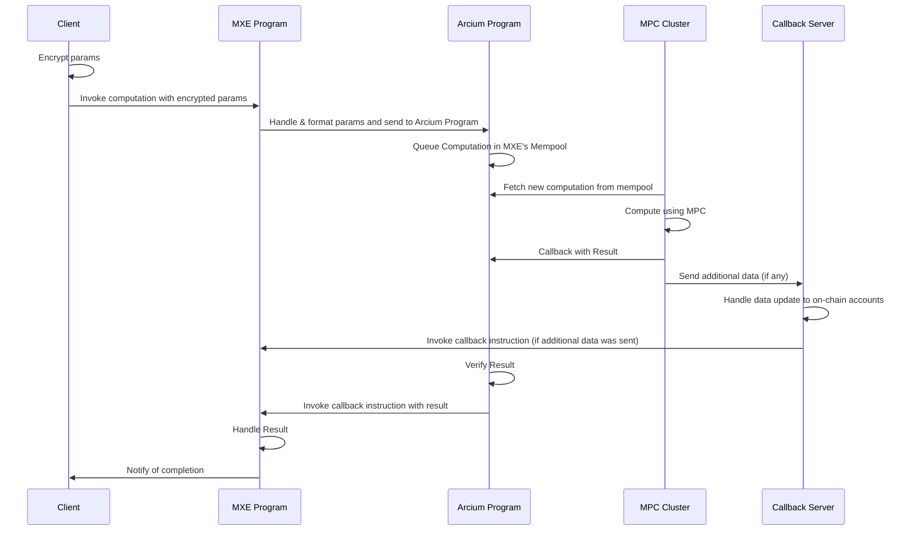

now ok
i wanna make arcium and magicblock integration to the above app idea pls show a plan to do so

----

Arcium

# Intro to Arcium

Arcium is a decentralized private computation network that enables secure processing of encrypted data through Multi-Party Computation (MPC). It solves a fundamental problem in Web3: how to process sensitive data while maintaining privacy. Traditionally, computation requires data to be decrypted, making it vulnerable to attacks and exposing private information. Arcium changes this by allowing computations to run on fully encrypted data.

## What Arcium Enables

As a Solana developer, Arcium gives you the ability to:

1. **Build Privacy-Preserving Applications**: Add privacy to your applications without adopting a new blockchain, programming language, or workflow. Arcium maintains full composability within familiar ecosystems.
2. **Use Familiar Tooling**: Leverage the Arcis framework, which extends Solana's Anchor tooling. Built in Rust, it allows you to add privacy simply by marking functions as confidential—no cryptography knowledge required.
3. **Process Sensitive Data**: Run computations on encrypted data without ever decrypting it. This means sensitive information like user balances, trade orders, or personal data can be processed securely.

## How It Works

Your application (MXE) works with encrypted data in three simple steps:

1. Client encrypts data and sends it to your MXE program
2. Your program submits the computation to Arcium's network of MPC nodes
3. Nodes process the data while keeping it encrypted, then return the results

The entire process happens on-chain through Solana, with each step verified and coordinated by Arcium's programs. For larger computations, an optional callback server handles results that don't fit in a single transaction.

## Common Use Cases

1. **Private DeFi**: Build dark pools, aka private order books, where trade sizes and prices remain hidden, enabling truly permissionless confidential trading without front-running or market manipulation.
2. **Secure AI**: Enable AI model inference and training on sensitive data while keeping the data encrypted.
3. **Confidential Gaming**: Build hidden information games where player moves and state remain private until revealed (e.g., card games, strategy games, auctions).

## Getting Started

Arcium provides a familiar development experience for Solana developers:

* Use the `arcium` CLI (a wrapper over `anchor` CLI) to build Solana programs with Arcium
* Write confidential instructions in Rust using the Arcis framework
* Integrate with your Solana programs using the TypeScript client library

Follow these steps to get started:

1. [Install Arcium](/developers/installation) - Set up the development environment and tools
2. [Hello World](/developers/hello-world) - Create your first confidential instruction
3. [Computation Lifecycle](/developers/computation-lifecycle) - Understand how confidential computations work
4. [TypeScript SDK Reference](https://ts.arcium.com/api) - Complete API documentation for TypeScript client libraries

The network is currently in Public Testnet. Join our [Discord](https://discord.com/invite/arcium) to join our community and start building.


----

# Hello World with Arcium

## Hello World

The Arcium tooling suite for writing MXEs (MPC eXecution Environments) is built on top of [Anchor](https://www.anchor-lang.com/), so if you're familiar with Anchor, you should find Arcium to be a familiar experience, except that you're using the `arcium` CLI instead of `anchor`.

To initialize a new MXE project, you can therefore simply run:

```bash  theme={null}
arcium init <project-name>
```

This will create a new project with the given name, and initialize it with a basic structure. The structure is the same as in an Anchor project with two differences, so we won't repeat it here (for an explanation of the Anchor project structure, see the [Anchor documentation](https://www.anchor-lang.com/docs/quickstart/local)). The two differences are:

* The `Arcium.toml` file, which contains the configuration for the Arcium tooling suite.
* The `encrypted-ixs` directory. This is where we write all our code that is meant to operate on encrypted data and therefore runs in MPC. This code is written using our own Rust framework called [Arcis](/developers/arcis). This will already be populated with a simple example called `add_together.rs`. Let's take a closer look at it.

### Our first encrypted instruction

```rust  theme={null}
use arcis_imports::*;

#[encrypted]
mod circuits {
    use arcis_imports::*;

    pub struct InputValues {
        v1: u8,
        v2: u8,
    }

    #[instruction]
    pub fn add_together(input_ctxt: Enc<Shared, InputValues>) -> Enc<Shared, u16> {
        let input = input_ctxt.to_arcis();
        let sum = input.v1 as u16 + input.v2 as u16;
        input_ctxt.owner.from_arcis(sum)
    }
}
```

Let's go through it line by line. `use arcis_imports::*;` imports all the necessary types and functions for writing encrypted instructions with Arcis. The `#[encrypted]` attribute marks a module that contains encrypted instructions. Inside this module, we define a struct `InputValues` that contains the two values we want to encrypt and pass to the encrypted instruction.

The `#[instruction]` macro marks the function as an entry point for MPC execution - while you can write helper functions without this attribute, only functions marked with `#[instruction]` will be compiled into individual circuits that can be called onchain.

The function `add_together` takes an encrypted input parameter of type `Enc<Shared, InputValues>`. Let's break this down:

* `Enc<Owner, Data>` is Arcium's encrypted data type
* `Shared` means the data is encrypted with a shared secret between the client and MXE (both can decrypt it)
* `InputValues` is the actual data structure being encrypted (our struct with v1 and v2)
* The alternative to `Shared` is `Mxe`, where only the MXE can decrypt the data

Inside the function:

1. `input_ctxt.to_arcis()` converts the input into a form we can operate on within the MPC environment.
2. We perform the addition operation, casting the u8 values to u16 to prevent overflow.
3. `input_ctxt.owner.from_arcis(sum)` converts the encrypted sum into an encrypted format that can be stored onchain, while maintaining encryption with the shared secret between the client and the MXE.

### Calling it from Solana

Now that we've written our first confidential instruction, let's see how can use it from within a Solana program. Our default project already contains a Solana program in the `programs/` directory. Let's take a closer look at it too:

```rust  theme={null}
use anchor_lang::prelude::*;
use arcium_anchor::prelude::*;

// This constant identifies our encrypted instruction for on-chain operations
// comp_def_offset() generates a unique identifier from the function name
const COMP_DEF_OFFSET_ADD_TOGETHER: u32 = comp_def_offset("add_together");

declare_id!("YOUR_PROGRAM_ID_HERE");

#[arcium_program]
pub mod hello_world {
    use super::*;

    pub fn init_add_together_comp_def(ctx: Context<InitAddTogetherCompDef>) -> Result<()> {
        init_comp_def(ctx.accounts, true, 0, None, None)?;
        Ok(())
    }

    pub fn add_together(
        ctx: Context<AddTogether>,
        computation_offset: u64,
        ciphertext_0: [u8; 32],
        ciphertext_1: [u8; 32],
        pub_key: [u8; 32],
        nonce: u128,
    ) -> Result<()> {
        let args = vec![
            Argument::ArcisPubkey(pub_key),
            Argument::PlaintextU128(nonce),
            Argument::EncryptedU8(ciphertext_0),
            Argument::EncryptedU8(ciphertext_1),
        ];

        ctx.accounts.sign_pda_account.bump = ctx.bumps.sign_pda_account;

        queue_computation(
            ctx.accounts,
            computation_offset,
            args,
            None,
            vec![AddTogetherCallback::callback_ix(&[])],
        )?;
        Ok(())
    }

    #[arcium_callback(encrypted_ix = "add_together")]
    pub fn add_together_callback(
        ctx: Context<AddTogetherCallback>,
        output: ComputationOutputs<AddTogetherOutput>,
    ) -> Result<()> {
        let o = match output {
            ComputationOutputs::Success(AddTogetherOutput { field_0 }) => field_0,
            _ => return Err(ErrorCode::AbortedComputation.into()),
        };

        emit!(SumEvent {
            sum: o.ciphertexts[0],
            nonce: o.nonce.to_le_bytes(),
        });
        Ok(())
    }
}
```

For the sake of brevity, we don't include the `InitAddTogetherCompDef`, `AddTogether`, and `AddTogetherCallback` account structs here, but they're automatically generated when you run `arcium init`. Here's a simplified version of what `AddTogether` looks like:

```rust  theme={null}
#[derive(Accounts)]
#[instruction(computation_offset: u64)]
pub struct AddTogether<'info> {
    #[account(mut)]
    pub payer: Signer<'info>,
    // ... other required Arcium accounts (see program/ section for full details)
}
```

You can read more about them and the invokation of confidential instructions inside solana programs [here](/developers/program).

The key things to note here are that every mxe program is identified by the `#[arcium_program]` macro (which replaces anchor's `#[program]` macro) and that for every confidential instruction, we generally have three instructions in our solana program:

* `init_add_together_comp_def`: This is the instruction that initializes the confidential instruction definition. It is used to set up the computation definition and is therefore only called once prior to the first invocation of the confidential instruction. More info on this can be found [here](/developers/program/computation-def-accs).
* `add_together`: This is the instruction that invokes the confidential instruction. It takes in the arguments for the confidential instruction and queues it for execution using the Arcium program. More info on this can be found [here](/developers/program).
* `add_together_callback`: This is the instruction that is called by the MPC cluster when the confidential instruction has finished executing which returns our result. More info on this can be found [here](/developers/program).

This is due to the general flow of computations throughout Arcium, which you can read more about [here](/developers/computation-lifecycle).

## Building and testing

Similar to anchor, we can build the confidential instructions and Solana programs using `arcium build`. Testing is done using the `@arcium-hq/client` typescript library (more info on it can be found [here](/developers/js-client-library)) by default and can be run using `arcium test` (make sure you have installed the npm dependencies prior by running `yarn` or `npm install` in your project directory).

Let's take a quick look at the default test file. Note that some helper functions and imports are excluded for brevity, but you can find the complete examples in your generated project:

```typescript  theme={null}
describe("Hello World", () => {
  // Configure the client to use the local cluster.
  anchor.setProvider(anchor.AnchorProvider.env());
  const program = anchor.workspace.HelloWorld as Program<HelloWorld>;
  const provider = anchor.getProvider();

  const arciumEnv = getArciumEnv();

  it("Is initialized!", async () => {
    const owner = readKpJson(`${os.homedir()}/.config/solana/id.json`);

    console.log("Initializing add together computation definition");
    const initATSig = await initAddTogetherCompDef(program, owner, false);
    console.log(
      "Add together computation definition initialized with signature",
      initATSig
    );

    const privateKey = x25519.utils.randomSecretKey();
    const publicKey = x25519.getPublicKey(privateKey);
    const mxePublicKey = await getMXEPublicKeyWithRetry(
      provider as anchor.AnchorProvider,
      program.programId
    );

    console.log("MXE x25519 pubkey is", mxePublicKey);
    const sharedSecret = x25519.getSharedSecret(privateKey, mxePublicKey);
    const cipher = new RescueCipher(sharedSecret);

    const val1 = BigInt(1);
    const val2 = BigInt(2);
    const plaintext = [val1, val2];

    const nonce = randomBytes(16);
    const ciphertext = cipher.encrypt(plaintext, nonce);

    const sumEventPromise = awaitEvent("sumEvent");
    const computationOffset = new anchor.BN(randomBytes(8), "hex");

    const queueSig = await program.methods
      .addTogether(
        computationOffset,
        Array.from(ciphertext[0]),
        Array.from(ciphertext[1]),
        Array.from(publicKey),
        new anchor.BN(deserializeLE(nonce).toString())
      )
      .accountsPartial({
        computationAccount: getComputationAccAddress(
          program.programId,
          computationOffset
        ),
        clusterAccount: arciumEnv.arciumClusterPubkey,
        mxeAccount: getMXEAccAddress(program.programId),
        mempoolAccount: getMempoolAccAddress(program.programId),
        executingPool: getExecutingPoolAccAddress(program.programId),
        compDefAccount: getCompDefAccAddress(
          program.programId,
          Buffer.from(getCompDefAccOffset("add_together")).readUInt32LE()
        ),
      })
      .rpc({ commitment: "confirmed" });
    console.log("Queue sig is ", queueSig);

    const finalizeSig = await awaitComputationFinalization(
      provider as anchor.AnchorProvider,
      computationOffset,
      program.programId,
      "confirmed"
    );
    console.log("Finalize sig is ", finalizeSig);

    const sumEvent = await sumEventPromise;
    const decrypted = cipher.decrypt([sumEvent.sum], sumEvent.nonce)[0];
    expect(decrypted).to.equal(val1 + val2);
  });
});
```

This test demonstrates the complete flow of encrypted computations in Arcium. Here's what each key step does:

* `initAddTogetherCompDef`: Call the `init_add_together_comp_def` instruction to initialize the confidential instruction definition. (only need to be called once after the program is deployed)
* `getMXEPublicKeyWithRetry`: Fetch the MXE's x25519 public key.
* `x25519.utils.randomSecretKey`: Generate a random private key for the x25519 key exchange.
* `x25519.getPublicKey`: Generate the public key corresponding to the private key we generated above.
* `x25519.getSharedSecret`: Generate the shared secret with the MXE cluster using a x25519 key exchange.
* `cipher = new RescueCipher(sharedSecret)`: Initialize the Rescue cipher (the constructor internally performs a HKDF with HMAC based on the Rescue-Prime hash function, you can learn more [here](/developers/encryption))
* `cipher.encrypt`: Encrypt the inputs for the confidential instruction.
* `awaitEvent`: Wait for the `sumEvent` event to be emitted by the program on finalization of the computation (in the callback instruction).
* `addTogether`: Call the `add_together` instruction to invoke the confidential instruction.
* `awaitComputationFinalization`: Since waiting for an Arcium computation isn't the same as waiting for one Solana transaction (since we need to wait for the MPC cluster to finish the computation and invoke the callback), we wait using this function, which is provided by the Arcium typescript library.

## Ready to Deploy?

Now that you've built and tested your MXE locally, you're probably eager to see it running on devnet! Head over to our [deployment guide](/developers/deployment) where we'll walk you through getting your MXE live on Solana devnet. We'll cover everything from choosing the right RPC endpoint to initializing your computation definitions.

## What's Next?

Now that you've built your first MXE, you're ready to deploy it to testnet. Follow the [deployment guide](/developers/deployment) to get your MXE running on Solana devnet and test with real encrypted computations.

From there, you can build more sophisticated applications by learning about [input/output patterns](/developers/arcis/input-output) for working with encrypted data, [callback accounts](/developers/program/callback-accs) for persistent state, and [JavaScript client integration](/developers/js-client-library/encryption) for frontend development.

For inspiration, browse our [examples repo](https://github.com/arcium-hq/examples/) to see voting systems, games, and DeFi applications built with Arcium. If you need help, join our [Discord community](https://discord.gg/arcium) where other builders share tips and get support.


----

# Computation Lifecycle

Before diving into the details of the tooling, it's useful to understand the general architecture of Arcium. The below diagram gives a high-level overview of the lifecycle of a typical interaction with Arcium (we call these "computations").



We have 4 key actors here (with one additional participant if needed):

* The client: The party that wants to perform a computation, usually the user of your MXE. This is implemented using the [Arcium TypeScript Client Library](/developers/js-client-library).
* The MXE Program: Your app. An MXE (MPC eXecution Environment) consists of everything needed to perform computations and is implemented using the [Arcium program tooling](/developers/program):
  * A smart contract that is deployed on the blockchain and is used to format, submit submit computations to Arcium.
  * A set of confidential instructions (we call these "computation definitions") that are used to define what parameters are needed for the computation and what the computation is. Writing these is done using [Arcis](/developers/arcis).
  * Some metadata about the MXE, most importantly the MPC cluster we would like to use to compute our computations.
* The Arcium Program: The program in charge of assigning, scheduling, and verifying computations for the various MPC clusters to perform.
* The MPC Cluster: The parties that are performing the client's computations using MPC.
* The Callback Server: A server that is used to handle additional data from the MPC cluster. This is optional and only needed for cases when the computation result is more than what can fit in a single Solana transaction.


----

# Computation Lifecycle

Before diving into the details of the tooling, it's useful to understand the general architecture of Arcium. The below diagram gives a high-level overview of the lifecycle of a typical interaction with Arcium (we call these "computations").


We have 4 key actors here (with one additional participant if needed):

* The client: The party that wants to perform a computation, usually the user of your MXE. This is implemented using the [Arcium TypeScript Client Library](/developers/js-client-library).
* The MXE Program: Your app. An MXE (MPC eXecution Environment) consists of everything needed to perform computations and is implemented using the [Arcium program tooling](/developers/program):
  * A smart contract that is deployed on the blockchain and is used to format, submit submit computations to Arcium.
  * A set of confidential instructions (we call these "computation definitions") that are used to define what parameters are needed for the computation and what the computation is. Writing these is done using [Arcis](/developers/arcis).
  * Some metadata about the MXE, most importantly the MPC cluster we would like to use to compute our computations.
* The Arcium Program: The program in charge of assigning, scheduling, and verifying computations for the various MPC clusters to perform.
* The MPC Cluster: The parties that are performing the client's computations using MPC.
* The Callback Server: A server that is used to handle additional data from the MPC cluster. This is optional and only needed for cases when the computation result is more than what can fit in a single Solana transaction.


---

# Sealing aka re-encryption

Suppose you're Alice, and you have secret data onchain, and you want to share it with Bob. Or it could be that you want to compute a function on your sensitive data, and share the result with Bob without revealing the data, or the result to anyone else.

Arcium enables you to re-encrypt any data to a given public key. This is known as "sealing" in cryptography, effectively having the ability to restrict data access and information flow.

This is useful for a variety of reasons, such as compliance, end-to-end privacy, and more.

```rust  theme={null}
#[encrypted]
mod circuits {
    use arcis_imports::*;

    #[instruction]
    pub fn verify_loan_eligibility(
        alice_balance: Enc<Shared, u64>,
        min_balance_required: Enc<Mxe, u64>,
        loan_officer: Shared
    ) -> Enc<Shared, bool> {
        let balance = alice_balance.to_arcis();
        let threshold = min_balance_required.to_arcis();

        // Check if Alice meets minimum balance for loan without revealing her exact balance
        let is_eligible = balance >= threshold;

        // Re-encrypt the result for the loan officer
        loan_officer.from_arcis(is_eligible)
    }
}
```

In this example, we have a confidential function `verify_loan_eligibility` that takes Alice's encrypted balance (encrypted with a shared secret between Alice and the MXE), the minimum balance requirement (encrypted only for the MXE), and a `Shared` type parameter representing the loan officer who will receive the result.

The function checks if Alice meets the minimum balance requirement for loan eligibility without revealing her actual balance to anyone. The boolean result is then re-encrypted specifically for the loan officer using their public key. This way, Alice's financial privacy is preserved - the loan officer only learns whether she's eligible, not her actual balance, and the MPC nodes never see the unencrypted values.


----

# Overview

Arcis is a Rust-based framework designed for writing secure multi-party computation (MPC) circuits to be executed on the Arcium network. It provides developers with a powerful and intuitive interface to create privacy-preserving applications that can compute over encrypted data.

## Key Features

* **Rust-based**: Leverage the safety and performance of Rust in your MPC development.
* **Circuit-oriented**: Design and implement MPC circuits with ease.
* **Privacy-focused**: Enable computations on encrypted data without revealing the underlying information.

In the following sections, we'll dive deeper into Arcis' syntax, core components, and best practices for building efficient and secure MPC circuits.

--

# Operations

## Operations

Arcis supports many of Rust's native operations but extends them to work seamlessly with encrypted data, allowing you to write private computations using familiar Rust syntax. See the tables below for a detailed list of supported and unsupported operations.

### Table of contents

* [Expression support](#expression-support)
  * [Binary expressions](#binary-expressions)
  * [Casts](#cast-expressions)
  * [Literals](#literal-expressions)
  * [Methods](#method-calls)
  * [Paths](#paths)
* [Item support](#item-support)
* [Pattern support](#pattern-support)

## Expression support:

| Expression Name   | Example                        | Support         | Comments                                                                 |
| ----------------- | ------------------------------ | --------------- | ------------------------------------------------------------------------ |
| Array literal     | `[a, b]`                       | Supported       |                                                                          |
| Assignment        | `a = b;`                       | Supported       |                                                                          |
| Async block       | `async { ... }`                | Unsupported     |                                                                          |
| Await             | `foo().await`                  | Unsupported     |                                                                          |
| Binary expression | `a + b`                        | Partial Support | [See table below](#binary-expressions) for supported binary expressions. |
| Block expression  | `{ ... }`                      | Supported       |                                                                          |
| Break             | `break;`                       | Unsupported     |                                                                          |
| Function call     | `f(a, b)`                      | Partial Support | [See table below](#function-calls) for supported functions.              |
| Casts             | `a as u16`                     | Partial Support | [See table below](#cast-expressions) for supported conversions.          |
| Closures          | `\|a, b \| a + b`              | Supported       |                                                                          |
| Const block       | `const { ... }`                | Supported       |                                                                          |
| Continue          | `continue;`                    | Unsupported     |                                                                          |
| Field access/set  | `obj.field`                    | Supported       |                                                                          |
| For loop          | `for i in expr { ... }`        | Supported       | Note that `expr` will have its length known at compile-time.             |
| If                | `if cond { ... } else { ... }` | Supported       | Complexity is in O( then\_block + else\_block).                          |
| Indexing          | `a[idx]`                       | Supported       | Complexity will be in O(`a.len()`) if `idx` isn't known at compile-time. |
| If let            | `if let Some(x) = ...`         | Unsupported     |                                                                          |
| Literals          | `1u128`                        | Partial Support | [See table below](#literal-expressions) for supported literals.          |
| Loops             | `loop { ... }`                 | Unsupported     | Cannot be supported as the number of iterations is not known.            |
| Macros            | `println!("{}", q)`            | Partial Support | [See table below](#macros) for supported macros.                         |
| Match             | `match n { ... }`              | Unsupported     |                                                                          |
| Method calls      | `x.foo(a, b)`                  | Partial Support | [See table below](#method-calls) for supported methods.                  |
| Parentheses       | `(a + b)`                      | Supported       |                                                                          |
| Paths             | `Foo::bar`                     | Partial Support | [See table below](#paths) for supported paths.                           |
| Ranges            | `4..5`                         | Partial Support | Not supported in `arr[4..16]`.                                           |
| Raw addresses     | `&raw const foo`               | Unsupported     |                                                                          |
| References        | `&mut foo`                     | Supported       |                                                                          |
| Repeat arrays     | `[4u8; 128]`                   | Supported       |                                                                          |
| Return            | `return false;`                | Unsupported     |                                                                          |
| Struct literals   | `MyStruct { a: 12, b }`        | Supported       |                                                                          |
| Try expression    | `this_call_can_err()?;`        | Unsupported     |                                                                          |
| Tuple literal     | `(a, 4, c)`                    | Supported       |                                                                          |
| Unary expressions | `!x`                           | Partial Support | User-defined unary operations are not supported.                         |
| Unsafe            | `unsafe { ... }`               | Unsupported     |                                                                          |
| While loops       | `while x < 64 { ... }`         | Unsupported     | Cannot be supported as the number of iterations is not known.            |

### Binary expressions

Note: user-defined binary operations are currently unsupported.

| Example    | Supported types                            |
| ---------- | ------------------------------------------ |
| `a + b`    | Integers, floats                           |
| `a - b`    | Integers, floats                           |
| `a * b`    | Integers, floats                           |
| `a / b`    | Integers, floats                           |
| `a % b`    | Integers                                   |
| `a && b`   | Booleans                                   |
| `a \|\| b` | Booleans                                   |
| `a ^ b`    | Booleans                                   |
| `a & b`    | Booleans                                   |
| `a \| b`   | Booleans                                   |
| `a << b`   | None                                       |
| `a >> b`   | Integers, if `b` is known at compile time. |
| `a == b`   | All. Use `derive(PartialEq)` for structs.  |
| `a != b`   | All. Use `derive(PartialEq)` for structs.  |
| `a < b`    | Booleans, integers, floats                 |
| `a <= b`   | Booleans, integers, floats                 |
| `a >= b`   | Booleans, integers, floats                 |
| `a > b`    | Booleans, integers, floats                 |
| `a += b`   | Integers, floats                           |
| `a -= b`   | Integers, floats                           |
| `a *= b`   | Integers, floats                           |
| `a /= b`   | Integers, floats                           |
| `a %= b`   | Integers                                   |
| `a ^= b`   | Booleans                                   |
| `a &= b`   | Booleans                                   |
| `a \|= b`  | Booleans                                   |
| `a <<= b`  | None                                       |
| `a >>= b`  | Integers, if `b` is known at compile time  |

### Cast expressions

`a as MyType` is only supported:

| From Type    | To Type      |
| ------------ | ------------ |
| integer type | integer type |
| `bool`       | integer type |
| integer type | `bool`       |
| `&...&T`     | `&T`         |

### Function calls

The following function calls are supported:

* user-defined function calls (without recursion)
* `ArcisRNG::bool()` to generate a boolean.
* `ArcisRNG::gen_integer_from_width(width: usize) -> u128`. Generates a secret integer between 0 and 2^width - 1 included.
* `ArcisRNG::gen_public_integer_from_width(width: usize) -> u128`. Generates a public integer between 0 and 2^width - 1 included.
* `ArcisRNG::gen_integer_in_range(min: u128, max: u128, n_attempts: usize) -> (result: u128, success: bool)`. See function doc for more information.
* `ArcisRNG::shuffle(slice)` on slices. Complexity is in `O(n*log³(n) + n*log²(n)*sizeof(T))`.
* `Mxe::get()` to be able to create MXE-owned secret data.
* `Shared::new(arcis_public_key)` to share private data with `arcis_public_key`.
* `ArcisPublicKey::from_base58(base58_byte_string)` to create a public key from a base58-encoded address.
* `ArcisPublicKey::from_uint8(u8_byte_slice)` to create a public key from a Uint8 array.

### Literal expressions

| Example     | Support     |
| ----------- | ----------- |
| `"foo"`     | Unsupported |
| `b"foo"`    | Supported   |
| `c"foo"`    | Unsupported |
| `b'f'`      | Supported   |
| `'a'`       | Unsupported |
| `1`         | Supported   |
| `1u16`      | Supported   |
| `1f64`      | Supported   |
| `1.0e10f64` | Supported   |
| `true`      | Supported   |

### Macros

The following macros are supported in order to help you debug your rust code:

* `debug_assert!`, `debug_assert_ne!`, `debug_assert_eq!`. They do not change instruction behavior and are only useful for debugging your rust code.
* `eprint!`, `eprintln!`, `print!`, `println!`. They do not change instruction behavior and are only useful for debugging your rust code.

### Method calls

The following method calls are supported:

* user-defined method calls (without generics and without recursion)
* `.clone()` on all `Clone` objects.
* `.len()`, `.is_empty()`, `.swap(a, b)`, `.fill(value)`, `.reverse()`, `.iter()`, `.iter_mut()`, `.into_iter()`, `.windows(width)` on arrays.
* `.sort()` on arrays of integers. Complexity is in `O(n*log²(n)*bit_size)`.
* `.enumerate()`, `.chain(other)`, `.cloned()`, `.copied()`, `.count()`, `.rev()`, `.zip(other)`, `.map(func)`, `.for_each(func)`, `.fold(init, func)` on iterators.
* `.take(n)`, `.skip(n)`, `.step_by(n)` on iterators when `n` is compile-time known.
* `.reveal()` if not inside a `if` or a `else`
* `.to_arcis()` on `Enc`s
* `.from_arcis(x)` on `Owner`s (objects of types `Mxe` or `Shared`) if not inside a `if` or a `else`
* `.abs()`, `.min(x)`, `.max(x)` on integers and floats
* `.abs_diff(other)`, `.is_positive()`, `.is_negative()` on integers
* `.to_le_bytes()`, `to_be_bytes()` on typed integers (does not work on integers the interpreter does not know the type)
* `.exp()`, `.exp2()`, `.ln()`, `.log2()`, `.sqrt()` on floats.

### Paths

The following paths are supported:

* `IntType::BITS`, `IntType::MIN` and `IntType::MAX` where `IntType` is an integer type.
* Paths to user-defined constants, functions and structs, as long as they don't use the unsupported `crate` or `super`.
* `std::mem::replace` and `std::mem::swap`

## Item support:

| Item Name         | Example                   | Support         | Comments                                                      |
| ----------------- | ------------------------- | --------------- | ------------------------------------------------------------- |
| Constant          | `const MAX: u16 = 65535`  | Supported       |                                                               |
| Enum              | `enum MyEnum { ... }`     | Unsupported     |                                                               |
| Extern            | `extern ...`              | Unsupported     |                                                               |
| Functions         | `fn foo() -> u8 { 0 }`    | Partial Support | Recursive functions are not supported.                        |
| Impls             | `impl MyType { ... }`     | Partial Support | Traits are not supported. `MyType` should not be a reference. |
| Macro Definitions | `macro_rules! ...`        | Unsupported     |                                                               |
| Macro Invocations | `println!(...)`           | Partial Support | [See table above](#macros) for supported macros.              |
| Modules           | `mod my_module { ... }`   | Supported       |                                                               |
| Statics           | `static ...`              | Unsupported     |                                                               |
| Structs           | `struct MyStruct { ... }` | Supported       |                                                               |
| Traits            | `trait MyTrait { ... }`   | Unsupported     |                                                               |
| Type Aliases      | `type MyId = usize;`      | Supported       |                                                               |
| Union             | `union MyUnion { ... }`   | Unsupported     |                                                               |
| Use               | `use arcis_imports::*`    | Partial Support | Only `use arcis_imports::` is supported.                      |

## Pattern support:

The following patterns are supported in function arguments and `let` statements:

* simple idents: `let ident = ...;`
* mutable idents: `let mut ident = ...;`
* ref idents: `let ref ident = ...;`
* mutable ref idents: `let ref mut ident = ...;`
* parentheses around a supported pattern: `let (...) = ...;`
* reference of a supported pattern: `let &... = ...;`
* array of supported patterns: `let [...] = ...;`
* struct of supported patterns: `let MyStruct { ... } = ...;`
* tuple of supported patterns: `let (...) = ...;`
* tuple struct of supported patterns: `let MyStruct(...) = ...;`
* type pattern of a supported pattern: `let ...: ty = ...;`
* wild pattern: `let _ = ...;`

Note: in particular, the `..` pattern is currently unsupported.

#### Performance Considerations

While Arcis provides these operations on encrypted data, it's important to note that operations on encrypted data are more computationally expensive than their plaintext counterparts. Complex calculations can lead to increased computation time and resource usage. It's recommended to optimize your algorithms to minimize the number of operations on encrypted data where possible.


---

# Types

The following types are supported:

* `u8`, `u16`, `u32`, `u64`, `u128`, `usize`, `i8`, `i16`, `i32`, `i64`, `i128`, `isize`
* `f64`, `f32` (Note: these types are emulated by the fixed-point numbers `k-2^-52`, for `k` between `-2^250` and `2^250`.)
* tuples of supported types, including `()`
* fixed-length arrays of a supported type
* (mutable) references to a supported type
* user-defined structs of supported types
* functions (but not as input or output of an encrypted instruction)
* `ArcisPublicKey`, an Arcis public key wrapper.
* Arcis-defined `Enc`, `Mxe` and `Shared`.

In particular, we do not currently support `HashMap`, `Vec`, `String` (we do not support types with a variable `len`). Constant-size byte strings (like `b"hello_world"`) are supported.

Here, `Enc` type defines the encrypted data input, which is used as `Enc<Owner, T>` where `Owner` can be either `Mxe` or `Shared`, signaling which party the data of type `T` can be decrypted by. You can read more about dealing with encrypted inputs/outputs [here](/developers/arcis/input-output).

Note: Currently all these types get mapped to secret shares over the curve25519 scalar field under the hood, meaning they all take up the same amount of space. Changing this for better space utilization is on the roadmap and will be implemented soon.


----

# Input/Output

Inputs and outputs in confidential instructions are handled in the same way. Arcium network does not mutate any state itself. Both inputs and outputs can be encrypted or plaintext data, either being passed by value or by reference. Passing by reference is only possible for account data, where the Arcium nodes will be able fetching data from account. This is beneficial for accounts where data is larger than what can fit in a single Solana transaction, or if you want to avoid storage costs for the data while the computation is in progress (as each input has to be written to a computation object for the duration of the computation).

Encrypted data is passed as an `Enc<Owner, T>` generic type, where `Owner` specifies who can decrypt the data:

* **`Enc<Shared, T>`**: Data encrypted with a shared secret between the client and MXE. Both the client and MXE can decrypt this data. Use this when:
  * Accepting user inputs that the user needs to verify later
  * Returning results the user must be able to decrypt
  * Implementing privacy-preserving user interactions
* **`Enc<Mxe, T>`**: Data encrypted exclusively for the MXE. Only the MXE nodes (acting together) can decrypt this data. Use this when:
  * Storing internal state that users shouldn't access directly
  * Passing data between MXE functions
  * Protecting protocol-level data from individual users

Learn more about [encryption in Arcium Network](/developers/encryption).

```rust  theme={null}
// Define the data structures we'll work with
struct Order {
    size: u64,
    bid: bool,
    owner: u128,
}

// OrderBook must be a fixed-size structure for MPC
const ORDER_BOOK_SIZE: usize = 100; // Maximum orders supported

struct OrderBook {
    orders: [Order; ORDER_BOOK_SIZE],
}

#[instruction]
pub fn add_order(
    order_ctxt: Enc<Shared, Order>,
    ob_ctxt: Enc<Mxe, &OrderBook>,
) -> Enc<Mxe, OrderBook> {
    let order = order_ctxt.to_arcis();
    let mut ob = *(ob_ctxt.to_arcis());
    let mut found = false;
    for i in 0..ORDER_BOOK_SIZE {
        let overwrite = ob.orders[i].size == 0 && !found;
        if overwrite {
            ob.orders[i] = order;
        }
        found = overwrite || found;
    }
    ob_ctxt.owner.from_arcis(ob)
}
```

Let's use this example to understand how to pass inputs into confidential instructions, compute on them and return outputs. Here, we are trying to add an order to an existing order book.

In this example, `order_ctxt: Enc<Shared, Order>` is passed by value, meaning the entire encrypted order data is submitted onchain. In contrast, `ob_ctxt: Enc<Mxe, &OrderBook>` is passed by reference - only the account's public key is submitted onchain, and the MPC nodes will fetch the actual data from that account during computation. This is particularly useful for large data structures like order books that might not fit in a single transaction.

In order to use the parameters `order_ctxt` and `ob_ctxt` for computation, we need to convert them to corresponding secret shares for the nodes to compute in MPC. This can be done by calling `to_arcis` function on any `Enc` generic parameter. This does not reveal the plaintext data underneath to the nodes during the process.

Here, the order parameter disappears after the confidential instruction has been processed (just as you'd expect in regular rust too). To output the new order book, we convert it back using `from_arcis` on `ob_ctxt.owner` field which defines the owner, aka the party which encrypted the data, to get the new `Enc<Origin, T>` type, and return it.

Currently, as many outputs as can fit in a single transaction are sent in the callback transaction, whereas the rest are all sent to the [callback server](/developers/callback-server) for state updates. This means that you might need to make state changes through the callback server, and are responsible for updating the on-chain accounts, if needed.

For more details on how to invoke these encrypted instructions from your Solana program, see [Invoking a Computation](/developers/program).


---

# Best practices

We provide here a set of miscellaneous tips and tricks and things to keep in mind when writing confidential instructions and programs.

## Execution flow

While we strive to make the Arcis compiler accept inputs that are as close as possible to standard rust code, there are some differences. Fundamentally, this is because code emitted by the Arcis compiler will not depend on the value of private inputs and so must be data independent (Intuitively, this makes sense. If the execution flow of our code depended on the value of a private input, an external observer could use this to learn information about the private values). We highlight here a few examples to keep in mind.

* If/else statements. We would normally not be able to use a masked value in the condition of an if statement. The Arcis compiler will however interpret this correctly and rewrite it into a data independent form. Since this is done by a macro, some syntax valid for the rust compiler will not be accepted (missing else branch, or else if clauses). Additionally, you will not gain any performance from using a masked value in the condition of an if statement: the program will still execute both branches, and just not use the result of the branch that is not taken.
* In general, control flow behavior that depends on a masked value is not supported. This includes early returns, or break statements in for loops, for example. A good rule of thumb is that the execution flow should be the same, no matter what value is masked.
* Currently, variable sized types such as `Vec<T>` are also not supported as length of the data should be known at compile time.

## Operations

Arcium supports multiple MPC backends, but all are based on additive-secret sharing. This has a few implications on what operations are more and less expensive, so we present a few guidelines below. Of course, performance always depends on the exact circuit. These are heuristic and not rules.

* Multiplications between secret values are significantly more expensive than on plaintext, as they involve heavy pre-processing and communication. - Multiplications between a secret and a plaintext value, as well as additions between secret/plaintext values, are basically free and run at pretty much the same speed as on plaintext data.
* Comparisons require conversion from Scalars to arrays of boolean bits which we then compare element-wise. This is a relatively expensive operation. A good rule of thumb is therefore the ordering of performance (where additions is the cheapest operation) is additions -> multiplications -> comparisons.


---

# Overview

Before reading this, we recommend having read the [Computation Lifecycle](/developers/computation-lifecycle) section, the [Arcis inputs/outputs](/developers/arcis/input-output) section, and the [Callback Type Generation](/developers/program/callback-type-generation) guide to understand how output types like `AddTogetherOutput` are automatically generated from encrypted instructions.

## The Basics

Let's say we have the following encrypted instruction and want to invoke it from our MXE.

```rust  theme={null}
#[encrypted]
mod circuits {
    use arcis_imports::*;

    pub struct InputValues {
        v1: u8,
        v2: u8,
    }

    #[instruction]
    pub fn add_together(input_ctxt: Enc<Shared, InputValues>) -> Enc<Shared, u16> {
        let input = input_ctxt.to_arcis();
        let sum = input.v1 as u16 + input.v2 as u16;
        input_ctxt.owner.from_arcis(sum)
    }
}
```

To do this, we first need to receive the encrypted parameter of type `InputValues` which contains two encrypted `u8`s, then encode them into the `Argument` format, and finally queue the computation for execution. Additionally, we need to define a callback instruction that will be invoked when the computation is complete. Callback instructions have a few requirements:

1. They must be defined with the `#[arcium_callback(encrypted_ix = "encrypted_ix_name")]` macro.
2. They must have exactly two arguments: `ctx: Context<...>` and `output: ComputationOutputs<T>` where `T` is named as `{encrypted_ix_name}Output`.

For passing encrypted arguments, if the corresponding argument is `Enc<Shared, T>`, then we need to pass the `Argument::ArcisPubkey(pub_key)` and `Argument::PlaintextU128(nonce)`, before the ciphertext. If the corresponding argument is `Enc<Mxe, T>`, then we only need to pass the nonce as `Argument::PlaintextU128(nonce)` and the ciphertext. Ciphertexts are passed as `Argument::EncryptedXYZ(ciphertext)` where `XYZ` is the type of the ciphertext, with the possibilities being `EncryptedU8`, `EncryptedU16`, `EncryptedU32`, `EncryptedU64`, `EncryptedU128`, `EncryptedBool`.

```rust  theme={null}
pub fn add_together(
    ctx: Context<AddTogether>,
    computation_offset: u64,
    ciphertext_0: [u8; 32],
    ciphertext_1: [u8; 32],
    pub_key: [u8; 32],
    nonce: u128,
) -> Result<()> {
    // Build the args the confidential instruction expects (ArcisPubkey, nonce, EncryptedU8, EncryptedU8)
    let args = vec![
        Argument::ArcisPubkey(pub_key),
        Argument::PlaintextU128(nonce),
        Argument::EncryptedU8(ciphertext_0),
        Argument::EncryptedU8(ciphertext_1),
    ];

    // Set the bump for the sign_pda_account
    ctx.accounts.sign_pda_account.bump = ctx.bumps.sign_pda_account;

    // Build & queue our computation (via CPI to the Arcium program)
    queue_computation(
        ctx.accounts,
        // Random offset for the computation
        computation_offset,
        // The one-time inputs our confidential instruction expects
        args,
        // Callback server address
        // None here because the output of the confidential instruction can fit into a solana transaction
        // as its just 1 ciphertext which is 32 bytes
        None,
        // Use callback_ix() helper to generate the callback instruction
        vec![AddTogetherCallback::callback_ix(&[])],  // Empty array = no custom accounts
    )?;
    Ok(())
}

// Macro provided by the Arcium SDK to define a callback instruction.
#[arcium_callback(encrypted_ix = "add_together")]
pub fn add_together_callback(
    ctx: Context<AddTogetherCallback>,
    output: ComputationOutputs<AddTogetherOutput>,
) -> Result<()> {
    let o = match output {
        ComputationOutputs::Success(AddTogetherOutput { field_0 }) => field_0,
        _ => return Err(ErrorCode::AbortedComputation.into()),
    };

    emit!(SumEvent {
        sum: o.ciphertexts[0],
        nonce: o.nonce.to_le_bytes(),
    });

    Ok(())
}

```

Let's also have a look at the `Accounts` structs for each of these instructions:

```rust  theme={null}
/// Accounts required to invoke the `add_together` encrypted instruction.
/// `add_together` must be the name of the encrypted instruction we're invoking.

#[queue_computation_accounts("add_together", payer)]
#[derive(Accounts)]
#[instruction(computation_offset: u64)]
pub struct AddTogether<'info> {
    #[account(mut)]
    pub payer: Signer<'info>,
    #[account(
        init_if_needed,
        space = 9,
        payer = payer,
        seeds = [&SIGN_PDA_SEED],
        bump,
        address = derive_sign_pda!(),
    )]
    pub sign_pda_account: Account<'info, SignerAccount>,
    #[account(
        address = derive_mxe_pda!()
    )]
    pub mxe_account: Account<'info, MXEAccount>,
    #[account(
        mut,
        address = derive_mempool_pda!()
    )]
    /// CHECK: mempool_account, checked by the arcium program.
    pub mempool_account: UncheckedAccount<'info>,
    #[account(
        mut,
        address = derive_execpool_pda!()
    )]
    /// CHECK: executing_pool, checked by the arcium program.
    pub executing_pool: UncheckedAccount<'info>,
    #[account(
        mut,
        address = derive_comp_pda!(computation_offset)
    )]
    /// CHECK: computation_account, checked by the arcium program.
    pub computation_account: UncheckedAccount<'info>,
    #[account(
        address = derive_comp_def_pda!(COMP_DEF_OFFSET_ADD_TOGETHER)
    )]
    pub comp_def_account: Account<'info, ComputationDefinitionAccount>,
    #[account(
        mut,
        address = derive_cluster_pda!(mxe_account)
    )]
    pub cluster_account: Account<'info, Cluster>,
    #[account(
        mut,
        address = ARCIUM_FEE_POOL_ACCOUNT_ADDRESS,
    )]
    pub pool_account: Account<'info, FeePool>,
    #[account(
        address = ARCIUM_CLOCK_ACCOUNT_ADDRESS
    )]
    pub clock_account: Account<'info, ClockAccount>,
    pub system_program: Program<'info, System>,
    pub arcium_program: Program<'info, Arcium>,
}
```

That's a lot of accounts to remember! Here's what each one does:

**Core MXE Accounts:**

* `mxe_account`: Your MXE's metadata and configuration
* `mempool_account`: Queue where computations wait to be processed
* `executing_pool`: Tracks computations currently being executed
* `computation_account`: Stores individual computation data and results
* `comp_def_account`: Definition of your encrypted instruction (circuit)

**Arcium Network Accounts:**

* `cluster_account`: The MPC cluster that will process your computation
* `pool_account`: Arcium's fee collection account
* `clock_account`: Network timing information

**System Accounts:**

* `payer`: Pays transaction fees and rent
* `sign_pda_account`: PDA signer for the computation
* `system_program`: Solana's system program for account creation
* `arcium_program`: Arcium's core program that orchestrates MPC

The good news is these can be copy-pasted for any confidential instruction. You only need to change:

1. `COMP_DEF_OFFSET_ADD_TOGETHER` to match your instruction name
2. The instruction name in the `queue_computation_accounts` macro

How about the accounts for the callback instruction?

```rust  theme={null}
#[callback_accounts("add_together")]
#[derive(Accounts)]
pub struct AddTogetherCallback<'info> {
    pub arcium_program: Program<'info, Arcium>,
    /// Like above, COMP_DEF_PDA_SEED is a constant defined in the Arcium SDK.
    /// COMP_DEF_OFFSET_ADD_TOGETHER is an encrypted instruction specific u32
    /// offset which can be calculated with `comp_def_offset("add_together")`, where
    /// comp_def_offset is a function provided by the Arcium SDK and `add_together`
    /// is the name of the encrypted instruction we're invoking.
    #[account(
        address = derive_comp_def_pda!(COMP_DEF_OFFSET_ADD_TOGETHER)
    )]
    pub comp_def_account: Account<'info, ComputationDefinitionAccount>,
    #[account(address = ::anchor_lang::solana_program::sysvar::instructions::ID)]
    /// CHECK: instructions_sysvar, checked by the account constraint
    pub instructions_sysvar: AccountInfo<'info>,
}
```

Here it's a lot fewer accounts fortunately! Like with the `AddTogether` struct, we need to change the parameter for the `derive_comp_def_pda` macro and in the `callback_accounts` macro depending on the encrypted instruction we're invoking.

The `callback_ix()` method is a convenient helper generated by the `#[callback_accounts]` macro that automatically creates the proper callback instruction with all required accounts.

But what if we don't just want to return a raw value and need some additional accounts? Check out [input/outputs](/developers/arcis/input-output) for how to handle encrypted data and [callback accounts](/developers/program/callback-accs) for returning additional accounts in the callback.


---

# Overview

Before reading this, we recommend having read the [Computation Lifecycle](/developers/computation-lifecycle) section, the [Arcis inputs/outputs](/developers/arcis/input-output) section, and the [Callback Type Generation](/developers/program/callback-type-generation) guide to understand how output types like `AddTogetherOutput` are automatically generated from encrypted instructions.

## The Basics

Let's say we have the following encrypted instruction and want to invoke it from our MXE.

```rust  theme={null}
#[encrypted]
mod circuits {
    use arcis_imports::*;

    pub struct InputValues {
        v1: u8,
        v2: u8,
    }

    #[instruction]
    pub fn add_together(input_ctxt: Enc<Shared, InputValues>) -> Enc<Shared, u16> {
        let input = input_ctxt.to_arcis();
        let sum = input.v1 as u16 + input.v2 as u16;
        input_ctxt.owner.from_arcis(sum)
    }
}
```

To do this, we first need to receive the encrypted parameter of type `InputValues` which contains two encrypted `u8`s, then encode them into the `Argument` format, and finally queue the computation for execution. Additionally, we need to define a callback instruction that will be invoked when the computation is complete. Callback instructions have a few requirements:

1. They must be defined with the `#[arcium_callback(encrypted_ix = "encrypted_ix_name")]` macro.
2. They must have exactly two arguments: `ctx: Context<...>` and `output: ComputationOutputs<T>` where `T` is named as `{encrypted_ix_name}Output`.

For passing encrypted arguments, if the corresponding argument is `Enc<Shared, T>`, then we need to pass the `Argument::ArcisPubkey(pub_key)` and `Argument::PlaintextU128(nonce)`, before the ciphertext. If the corresponding argument is `Enc<Mxe, T>`, then we only need to pass the nonce as `Argument::PlaintextU128(nonce)` and the ciphertext. Ciphertexts are passed as `Argument::EncryptedXYZ(ciphertext)` where `XYZ` is the type of the ciphertext, with the possibilities being `EncryptedU8`, `EncryptedU16`, `EncryptedU32`, `EncryptedU64`, `EncryptedU128`, `EncryptedBool`.

```rust  theme={null}
pub fn add_together(
    ctx: Context<AddTogether>,
    computation_offset: u64,
    ciphertext_0: [u8; 32],
    ciphertext_1: [u8; 32],
    pub_key: [u8; 32],
    nonce: u128,
) -> Result<()> {
    // Build the args the confidential instruction expects (ArcisPubkey, nonce, EncryptedU8, EncryptedU8)
    let args = vec![
        Argument::ArcisPubkey(pub_key),
        Argument::PlaintextU128(nonce),
        Argument::EncryptedU8(ciphertext_0),
        Argument::EncryptedU8(ciphertext_1),
    ];

    // Set the bump for the sign_pda_account
    ctx.accounts.sign_pda_account.bump = ctx.bumps.sign_pda_account;

    // Build & queue our computation (via CPI to the Arcium program)
    queue_computation(
        ctx.accounts,
        // Random offset for the computation
        computation_offset,
        // The one-time inputs our confidential instruction expects
        args,
        // Callback server address
        // None here because the output of the confidential instruction can fit into a solana transaction
        // as its just 1 ciphertext which is 32 bytes
        None,
        // Use callback_ix() helper to generate the callback instruction
        vec![AddTogetherCallback::callback_ix(&[])],  // Empty array = no custom accounts
    )?;
    Ok(())
}

// Macro provided by the Arcium SDK to define a callback instruction.
#[arcium_callback(encrypted_ix = "add_together")]
pub fn add_together_callback(
    ctx: Context<AddTogetherCallback>,
    output: ComputationOutputs<AddTogetherOutput>,
) -> Result<()> {
    let o = match output {
        ComputationOutputs::Success(AddTogetherOutput { field_0 }) => field_0,
        _ => return Err(ErrorCode::AbortedComputation.into()),
    };

    emit!(SumEvent {
        sum: o.ciphertexts[0],
        nonce: o.nonce.to_le_bytes(),
    });

    Ok(())
}

```

Let's also have a look at the `Accounts` structs for each of these instructions:

```rust  theme={null}
/// Accounts required to invoke the `add_together` encrypted instruction.
/// `add_together` must be the name of the encrypted instruction we're invoking.

#[queue_computation_accounts("add_together", payer)]
#[derive(Accounts)]
#[instruction(computation_offset: u64)]
pub struct AddTogether<'info> {
    #[account(mut)]
    pub payer: Signer<'info>,
    #[account(
        init_if_needed,
        space = 9,
        payer = payer,
        seeds = [&SIGN_PDA_SEED],
        bump,
        address = derive_sign_pda!(),
    )]
    pub sign_pda_account: Account<'info, SignerAccount>,
    #[account(
        address = derive_mxe_pda!()
    )]
    pub mxe_account: Account<'info, MXEAccount>,
    #[account(
        mut,
        address = derive_mempool_pda!()
    )]
    /// CHECK: mempool_account, checked by the arcium program.
    pub mempool_account: UncheckedAccount<'info>,
    #[account(
        mut,
        address = derive_execpool_pda!()
    )]
    /// CHECK: executing_pool, checked by the arcium program.
    pub executing_pool: UncheckedAccount<'info>,
    #[account(
        mut,
        address = derive_comp_pda!(computation_offset)
    )]
    /// CHECK: computation_account, checked by the arcium program.
    pub computation_account: UncheckedAccount<'info>,
    #[account(
        address = derive_comp_def_pda!(COMP_DEF_OFFSET_ADD_TOGETHER)
    )]
    pub comp_def_account: Account<'info, ComputationDefinitionAccount>,
    #[account(
        mut,
        address = derive_cluster_pda!(mxe_account)
    )]
    pub cluster_account: Account<'info, Cluster>,
    #[account(
        mut,
        address = ARCIUM_FEE_POOL_ACCOUNT_ADDRESS,
    )]
    pub pool_account: Account<'info, FeePool>,
    #[account(
        address = ARCIUM_CLOCK_ACCOUNT_ADDRESS
    )]
    pub clock_account: Account<'info, ClockAccount>,
    pub system_program: Program<'info, System>,
    pub arcium_program: Program<'info, Arcium>,
}
```

That's a lot of accounts to remember! Here's what each one does:

**Core MXE Accounts:**

* `mxe_account`: Your MXE's metadata and configuration
* `mempool_account`: Queue where computations wait to be processed
* `executing_pool`: Tracks computations currently being executed
* `computation_account`: Stores individual computation data and results
* `comp_def_account`: Definition of your encrypted instruction (circuit)

**Arcium Network Accounts:**

* `cluster_account`: The MPC cluster that will process your computation
* `pool_account`: Arcium's fee collection account
* `clock_account`: Network timing information

**System Accounts:**

* `payer`: Pays transaction fees and rent
* `sign_pda_account`: PDA signer for the computation
* `system_program`: Solana's system program for account creation
* `arcium_program`: Arcium's core program that orchestrates MPC

The good news is these can be copy-pasted for any confidential instruction. You only need to change:

1. `COMP_DEF_OFFSET_ADD_TOGETHER` to match your instruction name
2. The instruction name in the `queue_computation_accounts` macro

How about the accounts for the callback instruction?

```rust  theme={null}
#[callback_accounts("add_together")]
#[derive(Accounts)]
pub struct AddTogetherCallback<'info> {
    pub arcium_program: Program<'info, Arcium>,
    /// Like above, COMP_DEF_PDA_SEED is a constant defined in the Arcium SDK.
    /// COMP_DEF_OFFSET_ADD_TOGETHER is an encrypted instruction specific u32
    /// offset which can be calculated with `comp_def_offset("add_together")`, where
    /// comp_def_offset is a function provided by the Arcium SDK and `add_together`
    /// is the name of the encrypted instruction we're invoking.
    #[account(
        address = derive_comp_def_pda!(COMP_DEF_OFFSET_ADD_TOGETHER)
    )]
    pub comp_def_account: Account<'info, ComputationDefinitionAccount>,
    #[account(address = ::anchor_lang::solana_program::sysvar::instructions::ID)]
    /// CHECK: instructions_sysvar, checked by the account constraint
    pub instructions_sysvar: AccountInfo<'info>,
}
```

Here it's a lot fewer accounts fortunately! Like with the `AddTogether` struct, we need to change the parameter for the `derive_comp_def_pda` macro and in the `callback_accounts` macro depending on the encrypted instruction we're invoking.

The `callback_ix()` method is a convenient helper generated by the `#[callback_accounts]` macro that automatically creates the proper callback instruction with all required accounts.

But what if we don't just want to return a raw value and need some additional accounts? Check out [input/outputs](/developers/arcis/input-output) for how to handle encrypted data and [callback accounts](/developers/program/callback-accs) for returning additional accounts in the callback.


---

# Callback Accounts

Callback accounts provide a way to define additional accounts to be used in the callback instruction for a computation. This is helpful when you want to use the output of a computation to modify an onchain account.

**Prerequisites**: Before diving into callback accounts, make sure you've read:

* [Basic program invocation guide](/developers/program) - fundamentals of queuing computations and defining callback instructions
* [Callback Type Generation](/developers/program/callback-type-generation) - how output types like `AddTogetherOutput` are automatically generated from encrypted instructions
* [Arcis inputs/outputs](/developers/arcis/input-output) - handling encrypted data types

**When to use callback accounts:**

* Storing computation results in persistent accounts
* Updating game state, user balances, or protocol data
* Writing results that exceed transaction size limits

## Complete Example

Expanding on our [basic example](/developers/program), let's say we want to save the result of our addition in an account for later use. We'll walk through the complete implementation step by step.

### Step 1: Define the Account Structure

First, define an account to store our computation result:

```rust  theme={null}
#[account]
#[derive(InitSpace)]
pub struct SecretAdditionResult {
    pub sum: [u8; 32], // Store the encrypted result as ciphertext
}

pub fn init(ctx: Context<Initialize>) -> Result<()> {
    Ok(())
}

#[derive(Accounts)]
pub struct Initialize<'info> {
    #[account(mut)]
    pub signer: Signer<'info>,
    #[account(
        init,
        payer = signer,
        seeds = [b"AdditionResult"],
        space = 8 + SecretAdditionResult::INIT_SPACE,
        // Note: In a real implementation you should usually save the bump too,
        // but for the sake of simplicity in this example we skip that
        bump
    )]
    pub add_result_account: Account<'info, SecretAdditionResult>,
    pub system_program: Program<'info, System>,
}
```

### Step 2: Modify the Queue Function

There are two ways to specify callback instructions in your `queue_computation` call:

#### Recommended: Using callback\_ix() Helper

The `callback_ix()` helper method is the **preferred approach** because it automatically handles the 3 required standard accounts and is less error-prone.

**What callback\_ix() does automatically:**

* Creates a CallbackInstruction with the proper instruction data
* Automatically includes 3 standard accounts: `arcium_program`, `comp_def_account`, `instructions_sysvar`
* Accepts custom accounts through the `&[CallbackAccount]` parameter
* Eliminates boilerplate and prevents errors

```rust  theme={null}
pub fn add_together(
    ctx: Context<AddTogether>,
    computation_offset: u64,
    ciphertext_0: [u8; 32],
    ciphertext_1: [u8; 32],
    pub_key: [u8; 32],
    nonce: u128,
) -> Result<()> {
    // Note: Using `create_program_address` with the bump would be more efficient than `find_program_address`.
    // Since this PDA is constant, you could also derive it at compile time and save it as a constant.
    // We use find_program_address here for simplicity.
    let addition_result_pda = Pubkey::find_program_address(&[b"AdditionResult"], ctx.program_id).0;

    // Build the args the confidential instruction expects (ArcisPubkey, nonce, EncryptedU8, EncryptedU8)
    let args = vec![
        Argument::ArcisPubkey(pub_key),
        Argument::PlaintextU128(nonce),
        Argument::EncryptedU8(ciphertext_0),
        Argument::EncryptedU8(ciphertext_1),
    ];

    // Set the bump for the sign_pda_account
    ctx.accounts.sign_pda_account.bump = ctx.bumps.sign_pda_account;

    // Build & queue our computation (via CPI to the Arcium program)
    queue_computation(
        ctx.accounts,
        // Random offset for the computation
        computation_offset,
        // The one-time inputs our confidential instruction expects
        args,
        // Callback server address
        // None here because the output of the confidential instruction can fit into a solana transaction
        // as its just 1 Ciphertext which is 32 bytes
        None,
        // Using callback_ix() helper - automatically includes the 3 standard accounts
        // (arcium_program, comp_def_account, instructions_sysvar) plus our custom account
        vec![AddTogetherCallback::callback_ix(&[
            CallbackAccount {
                pubkey: addition_result_pda,
                is_writable: true, // Tells nodes to mark this account as writable in the transaction
            }
        ])],
    )?;
    Ok(())
}

/* The AddTogether accounts struct stays exactly the same as shown in the basic guide */
```

#### Understanding What Happens: Manual CallbackInstruction

For educational purposes, here's what `callback_ix()` generates under the hood. This manual approach is functionally equivalent but more verbose and error-prone:

```rust  theme={null}
pub fn add_together(
    ctx: Context<AddTogether>,
    computation_offset: u64,
    ciphertext_0: [u8; 32],
    ciphertext_1: [u8; 32],
    pub_key: [u8; 32],
    nonce: u128,
) -> Result<()> {
    // Note: Using `create_program_address` with the bump would be more efficient than `find_program_address`.
    // Since this PDA is constant, you could also derive it at compile time and save it as a constant.
    // We use find_program_address here for simplicity.
    let addition_result_pda = Pubkey::find_program_address(&[b"AdditionResult"], ctx.program_id).0;

    // Build the args the confidential instruction expects (ArcisPubkey, nonce, EncryptedU8, EncryptedU8)
    let args = vec![
        Argument::ArcisPubkey(pub_key),
        Argument::PlaintextU128(nonce),
        Argument::EncryptedU8(ciphertext_0),
        Argument::EncryptedU8(ciphertext_1),
    ];

    // Set the bump for the sign_pda_account
    ctx.accounts.sign_pda_account.bump = ctx.bumps.sign_pda_account;

    // Build & queue our computation (via CPI to the Arcium program)
    queue_computation(
        ctx.accounts,
        // Random offset for the computation
        computation_offset,
        // The one-time inputs our confidential instruction expects
        args,
        // Callback server address
        // None here because the output of the confidential instruction can fit into a solana transaction
        // as its just 1 ciphertext which is 32 bytes
        None,
        // Manual approach: Define which callback instruction to call when the computation is complete.
        // We specify the program ID, instruction discriminator, and all accounts needed
        // for the callback, including our result account which we want to be writable.
        vec![CallbackInstruction {
            program_id: ID_CONST,
            discriminator: instruction::AddTogetherCallback::DISCRIMINATOR.to_vec(),
            accounts: vec![
                // Standard accounts (always required, in this order)
                CallbackAccount {
                    pubkey: ARCIUM_PROGRAM_ID,
                    is_writable: false,
                },
                CallbackAccount {
                    pubkey: derive_comp_def_pda!(COMP_DEF_OFFSET_ADD_TOGETHER),
                    is_writable: false,
                },
                CallbackAccount {
                    pubkey: INSTRUCTIONS_SYSVAR_ID,
                    is_writable: false,
                },
                // Custom accounts (your callback-specific accounts)
                CallbackAccount {
                    pubkey: addition_result_pda,
                    is_writable: true, // Tells nodes to mark this account as writable in the transaction
                }
            ]
        }],
    )?;
    Ok(())
}

/* The AddTogether accounts struct stays exactly the same as shown in the basic guide */
```

**Key Point**: Both approaches are functionally equivalent. The `callback_ix()` method automatically generates the exact same `CallbackInstruction` structure as the manual approach, but with less code and reduced chance for errors.

**Important**: We added the account to the callback (either via `callback_ix()` parameter or `CallbackInstruction.accounts`) but didn't include it in the AddTogether accounts struct because we don't read or write to it during the queue function - only during the callback.

### Step 3: Implement the Callback Function

The callback instruction receives the accounts in the exact order specified in the queue function:

```rust  theme={null}
// Macro provided by the Arcium SDK to define a callback instruction.
#[arcium_callback(encrypted_ix = "add_together")]
pub fn add_together_callback(
    ctx: Context<AddTogetherCallback>,
    output: ComputationOutputs<AddTogetherOutput>,
) -> Result<()> {
    let o = match output {
        ComputationOutputs::Success(AddTogetherOutput { field_0 }) => field_0,
        _ => return Err(ErrorCode::AbortedComputation.into()),
    };

    emit!(SumEvent {
        sum: o.ciphertexts[0],
        nonce: o.nonce.to_le_bytes(),
    });

    // Save the result in our callback account too
    ctx.accounts.add_result_account.sum = o.ciphertexts[0];

    Ok(())
}


#[callback_accounts("add_together")]
#[derive(Accounts)]
pub struct AddTogetherCallback<'info> {
    // Standard accounts (match the first 3 in CallbackInstruction.accounts)
    pub arcium_program: Program<'info, Arcium>,
    #[account(
        address = derive_comp_def_pda!(COMP_DEF_OFFSET_ADD_TOGETHER)
    )]
    pub comp_def_account: Account<'info, ComputationDefinitionAccount>,
    /// CHECK: instructions_sysvar, checked by the account constraint
    #[account(address = ::anchor_lang::solana_program::sysvar::instructions::ID)]
    pub instructions_sysvar: AccountInfo<'info>,

    // Custom accounts (match remaining accounts in CallbackInstruction.accounts)
    #[account(
        mut,
        seeds = [b"AdditionResult"],
        // Note: In a real implementation you should usually save the bump too,
        // but for the sake of simplicity in this example we skip that
        bump
    )]
    pub add_result_account: Account<'info, SecretAdditionResult>,
}
```

## Key Requirements & Constraints

### Account Ordering

The accounts in your callback struct **must match exactly** the order in `CallbackInstruction.accounts`:

1. First three accounts are always standard (arcium\_program, comp\_def\_account, instructions\_sysvar)
2. Custom accounts follow in the exact sequence you specified

### Account Creation Rules

* **Can create** accounts in the queue computation function (user pays rent)
* **Cannot create** accounts during callback execution (would require nodes to pay)
* Accounts must exist before the callback executes
* Account size cannot change during callback

### Writability Requirements

* Set `is_writable: true` in CallbackAccount to tell nodes to mark the account as writable
* The account must have `#[account(mut)]` in the callback struct
* Without proper writability flags, mutations will fail

## Troubleshooting

**Account not found**: Ensure the account exists before callback execution. Initialize it in the queue function or a separate instruction.

**Order mismatch errors**: Double-check that your callback struct accounts are in the exact same order as the CallbackInstruction.accounts vector.

**Cannot modify account**: Verify both `is_writable: true` in CallbackAccount and `#[account(mut)]` in the callback struct are set.

**Size errors**: Callback accounts cannot be resized. Allocate sufficient space when creating the account.

## Understanding callback\_ix() in Detail

The `callback_ix()` method you see throughout these examples is a convenient helper that's automatically generated by the `#[callback_accounts]` macro.

### How callback\_ix() Works

When you define a callback struct with `#[callback_accounts("instruction_name")]`, the macro automatically generates a `callback_ix()` method that:

1. **Creates a CallbackInstruction** with the proper instruction data
2. **Automatically includes 3 standard accounts** that every callback needs:
   * `arcium_program`: The Arcium program that will invoke your callback
   * `comp_def_account`: The computation definition account for your encrypted instruction
   * `instructions_sysvar`: Solana's instructions sysvar for transaction validation
3. **Accepts custom accounts** through the `&[CallbackAccount]` parameter

### Usage Patterns

**Basic usage (no custom accounts):**

```rust  theme={null}
vec![AddTogetherCallback::callback_ix(&[])]
```

The empty array indicates no custom accounts needed beyond the 3 standard ones.

**Advanced usage (with custom accounts):**

```rust  theme={null}
vec![AddTogetherCallback::callback_ix(&[
    CallbackAccount {
        pubkey: my_account.key(),
        is_writable: true,
    },
    // ... more custom accounts
])]
```

### Why Use callback\_ix()?

The `callback_ix()` helper is the **recommended approach** because it:

* **Eliminates boilerplate**: No need to manually construct CallbackInstruction
* **Prevents errors**: Automatically includes all required standard accounts
* **Maintains consistency**: Ensures your callback instructions follow the correct format
* **Simplifies maintenance**: Changes to callback requirements are handled by the macro

## Going Further

This guide covered the advanced patterns for working with callback accounts. To understand the fundamentals of callback instructions, see our [basic program invocation guide](/developers/program).

For handling different types of encrypted data inputs and outputs, see [Arcis inputs/outputs](/developers/arcis/input-output).


---

# Overview

## Overview

Arcium offers two TS libraries, which provide tools and utilities for interacting with Arcium and the MXEs (MPC eXecution Environments) deployed on it.

Client library `@arcium-hq/client`:

* Handle secret sharing and encryption of inputs
* Submit confidential transactions
* Manage callbacks for computation results

Reader library `@arcium-hq/reader`:

* Read MXE data
* View computations for a given MXE

Generally speaking, the client library is used to build & invoke computations on MXEs and then track their outputs, while the reader library is more so to track the overall network. To get a better idea of its place in the general architecture, we highly recommend taking a look at the [computation lifecycle](/developers/computation-lifecycle).

## Installation

Client library:

<CodeGroup>
  ```bash npm theme={null}
  npm install @arcium-hq/client
  ```

  ```bash yarn theme={null}
  yarn add @arcium-hq/client
  ```

  ```bash pnpm theme={null}
  pnpm add @arcium-hq/client
  ```
</CodeGroup>

Reader library:

<CodeGroup>
  ```bash npm theme={null}
  npm install @arcium-hq/reader
  ```

  ```bash yarn theme={null}
  yarn add @arcium-hq/reader
  ```

  ```bash pnpm theme={null}
  pnpm add @arcium-hq/reader
  ```
</CodeGroup>

## API Reference

For complete TypeScript SDK documentation and API reference for the client and reader libraries, visit: [ts.arcium.com/api](https://ts.arcium.com/api)

## Using the client

Prefer a more step-by-step approach? Get started with learning [how to encrypt inputs for confidential transactions](/developers/js-client-library/encryption).


--

# Encrypting inputs

Let's say we have the following confidential instruction that adds 2 encrypted `u8`s and returns the result as in plaintext:

```rust  theme={null}
use arcis_imports::*;

#[encrypted]
mod circuits {
    use arcis_imports::*;

    pub struct InputValues {
        v1: u8,
        v2: u8,
    }

    #[instruction]
    pub fn add_together(input_ctxt: Enc<Shared, InputValues>) -> u16 {
        let input = input_ctxt.to_arcis();
        let sum = input.v1 as u16 + input.v2 as u16;
        sum.reveal()
    }
}
```

We want to input the values `x = 42` and `y = 101` into this instruction. To do this, we first have to build the parameters for the confidential instruction correctly:

```ts  theme={null}
import { RescueCipher, getArciumEnv, x25519 } from "@arcium-hq/client";
import { randomBytes } from "crypto";

// Our confidential instruction takes two encrypted `u8` values as input, so we need to provide two ciphertext values which are represented as `[u8; 32]` in our Solana program.
const val1 = BigInt(1);
const val2 = BigInt(2);
const plaintext = [val1, val2];
```

Now that we have the inputs, we need to encrypt them. This is done using the `RescueCipher` class with some info about the MPC cluster we want to use:

```ts  theme={null}
// Fetch the MXE x25519 public key
const mxePublicKey = await getMXEPublicKeyWithRetry(
  provider as anchor.AnchorProvider,
  program.programId
);
// Generate a random private key for x25519 elliptic curve Diffie-Hellman key exchange.
const privateKey = x25519.utils.randomSecretKey();
// Derive the public key from the private key.
const publicKey = x25519.getPublicKey(privateKey);
// Generate a random nonce for the encryption.
const nonce = randomBytes(16);
// Get the shared secret with the cluster.
const sharedSecret = x25519.getSharedSecret(privateKey, mxePublicKey);
// Initialize the cipher with the shared secret.
const cipher = new RescueCipher(sharedSecret);
// Encrypt the plaintext, and serialize it to a `[u8; 32]` array.
const ciphertext = cipher.encrypt(plaintext, nonce);
```

To decrypt the data, again it follows a similar pattern:

```ts  theme={null}
// Initialize the cipher with the shared secret.
const cipher = new RescueCipher(sharedSecret);
const plaintext = cipher.decrypt(ciphertext, nonce);
```


---

# Tracking callbacks

Unlike regular transactions, confidential computations involve additional steps after your Solana transaction completes:

1. **Your transaction completes** - Encrypted data is submitted and queued in the MXE's mempool
2. **Computation waits in queue** - MPC nodes process computations from the mempool in order
3. **MPC execution** - When your computation's turn comes, MPC nodes execute it off-chain
4. **Callback invocation** - Results are returned via your callback instruction

This means you can't simply await a transaction completion like normal Solana programs. Instead, you need to wait for the entire computation lifecycle to finish. The Arcium client library provides utilities to handle this:

## Await computation completion with `awaitComputationFinalization`

```ts  theme={null}
// Generate a random 8-byte computation offset
const computationOffset = new anchor.BN(randomBytes(8), "hex");

// `program` is the anchor program client of the MXE we're invoking
// the instruction `ourIx` on (which then invokes a computation under the hood by CPIing into the Arcium program).
// `queueSig` is the signature of said transaction.
const queueSig = await program.methods
  .ourIx(
    // Computation offset that you provide when invoking the instruction
    computationOffset
    /* other inputs */
  )
  .accounts(/* some accounts */)
  .rpc();

// Since this is a Arcium computation, we need to wait for it to be finalized
// a little bit differently
const finalizeSig = await awaitComputationFinalization(
  // Anchor provider
  provider as anchor.AnchorProvider,
  // Computation offset that you provide when invoking the instruction
  computationOffset,
  // Program ID of the MXE
  program.programId,
  // Solana commitment level, "confirmed" by default
  "confirmed"
);

console.log("Computation was finalized with sig: ", finalizeSig);
```


---


# Deployment

## Getting Started with Deployment

So you've built and tested your MXE locally, and now you're ready to deploy it to Solana devnet. This guide will walk you through the deployment process and share some tips to make it go smoothly.

## What You'll Need

Before we dive into deployment, let's make sure you have everything ready:

* Your MXE built successfully with `arcium build`
* Tests passing locally with `arcium test`
* A Solana keypair with around 2-5 SOL for deployment costs (program deployment and account initialization)
* Access to a reliable RPC endpoint - we strongly recommend getting a free API key from [Helius](https://helius.dev), or [QuickNode](https://quicknode.com)

## Preparing Your Program

Before you deploy, there are a couple of important things to consider about how your program handles computation definitions.

### Handling Large Circuits with Offchain Storage

Here's something important to know: right now, Arcis compiled circuits aren't super efficient with their encoding, which means your circuit files can easily be several MBs in size. That makes initializing computation definitions on-chain pretty expensive - and will require a lot of transactions to fully upload.

The good news is you can store your circuits offchain instead. Just upload them to IPFS, a public S3 bucket, or even Supabase object storage - wherever works for you. Here's how to update your program to use offchain storage:

**Standard approach (works for small circuits):**

```rust  theme={null}
pub fn init_add_together_comp_def(ctx: Context<InitAddTogetherCompDef>) -> Result<()> {
    // This initializes the computation definition account
    init_comp_def(ctx.accounts, true, 0, None, None)?;
    Ok(())
}
```

**Offchain approach (recommended for larger circuits):**

```rust  theme={null}
// First, import the types you'll need
use arcium_client::idl::arcium::types::{CircuitSource, OffChainCircuitSource};

pub fn init_add_together_comp_def(ctx: Context<InitAddTogetherCompDef>) -> Result<()> {
    // Point to your uploaded circuit file
    init_comp_def(
        ctx.accounts,
        true,
        0,
        Some(CircuitSource::OffChain(OffChainCircuitSource {
            source: "https://your-storage.com/path/to/add_together_testnet.arcis".to_string(),
            hash: [0; 32], // Just use zeros for now - hash verification isn't enforced yet
        })),
        None,
    )?;
    Ok(())
}
```

With the offchain approach, you'll:

1. Build your project with `arcium build` to generate the circuit files
2. Upload the files from `build/` folder to your preferred storage service (files include network suffix, e.g., `add_together_testnet.arcis` for testnet)
3. Update your init functions in the Solana program with the public URLs
4. Run `arcium build` again to rebuild the Solana program with your changes

Note: Your circuit files must be publicly accessible without authentication. Make sure your storage service allows public read access.

This saves a ton on transaction costs and lets you work with much larger circuits!

### Note on Cluster Configuration

When testing locally, you've been using `arciumEnv.arciumClusterPubkey` in your test code. After deployment to devnet, you'll need to update this to use the actual cluster pubkey - we'll show you exactly how in the post-deployment section.

## Basic Deployment

The `arcium deploy` command handles both deploying your program and initializing the MXE account. Here's the basic command structure:

```bash  theme={null}
arcium deploy --cluster-offset <cluster-offset> --keypair-path <path-to-your-keypair> --rpc-url <your-rpc-url>
```

Let's break down what each parameter does:

### Understanding Cluster Offsets

The `--cluster-offset` tells your MXE which Arcium cluster it should connect to. Think of clusters as groups of nodes that will perform your encrypted computations. For devnet, you can choose from these offsets:

* `1078779259`
* `3726127828`
* `768109697`

Each represents a different cluster on devnet. They all work the same way, so just pick one for your deployment.

### Choosing Your RPC Provider

The `--rpc-url` parameter is particularly important. While you could use Solana's default RPC endpoints with the shorthand notation (`-u d` for devnet), the default RPC can be unreliable and cause deployment failures due to dropped transactions.

**Recommended approach with a reliable RPC:**

```bash  theme={null}
arcium deploy --cluster-offset 1078779259 \
  --keypair-path ~/.config/solana/id.json \
  --rpc-url https://devnet.helius-rpc.com/?api-key=<your-api-key>
```

**If you must use the default RPC:**

```bash  theme={null}
arcium deploy --cluster-offset 1078779259 \
  --keypair-path ~/.config/solana/id.json \
  -u d  # 'd' for devnet, 't' for testnet, 'l' for localnet
```

Just be prepared for potential transaction failures with the default RPC.

## Advanced Deployment Options

Once you're comfortable with basic deployment, you might want to customize things further.

### Adjusting Mempool Size

The mempool determines how many computations your MXE can queue up. The default "Tiny" size works fine for testing, but you might want more capacity for production:

```bash  theme={null}
arcium deploy --cluster-offset 1078779259 \
  --keypair-path ~/.config/solana/id.json \
  --rpc-url <your-rpc-url> \
  --mempool-size Medium
```

Available sizes are: `Tiny`, `Small`, `Medium`, `Large`. Start small and increase if you need more capacity.

### Using a Custom Program Address

If you need your program at a specific address (maybe for consistency across deployments), you can provide a program keypair:

```bash  theme={null}
arcium deploy --cluster-offset 1078779259 \
  --keypair-path ~/.config/solana/id.json \
  --rpc-url <your-rpc-url> \
  --program-keypair ./program-keypair.json
```

### Partial Deployments

Sometimes you might need to run just part of the deployment process. For instance, if you've already deployed the program but need to reinitialize the MXE account:

```bash  theme={null}
# Skip program deployment, only initialize MXE account
arcium deploy --cluster-offset 1078779259 \
  --keypair-path ~/.config/solana/id.json \
  --rpc-url <your-rpc-url> \
  --skip-deploy
```

Or if you only want to deploy the program without initialization:

```bash  theme={null}
# Deploy program only, skip MXE initialization
arcium deploy --cluster-offset 1078779259 \
  --keypair-path ~/.config/solana/id.json \
  --rpc-url <your-rpc-url> \
  --skip-init
```

## After Deployment

### Initialize Your Computation Definitions

Your MXE is deployed, but you still need to initialize the computation definitions. This tells the Arcium network what encrypted operations your MXE can perform. Computation definitions only need to be initialized once - they persist on-chain and don't need to be re-initialized unless you're deploying to a new program address. You can initialize them anytime after deployment completes successfully.

Remember how we mentioned you'd need to update your cluster configuration? Now's the time! You'll need to update your test or client code to use the actual cluster pubkey instead of the local testing environment.

**Replace this (local testing):**

```typescript  theme={null}
const arciumEnv = getArciumEnv();

// Later in your transaction...
.accountsPartial({
    clusterAccount: arciumEnv.arciumClusterPubkey,
    // ... other accounts
})
```

**With this (for devnet):**

```typescript  theme={null}
// Use the cluster offset from your deployment
const clusterAccount = getClusterAccAddress(cluster_offset); // e.g., getClusterAccAddress(1078779259)

// In your transaction...
.accountsPartial({
    clusterAccount: clusterAccount,
    // ... other accounts
})
```

Make sure to use the same `cluster_offset` value that you used during deployment! This ensures your program talks to the right cluster.

Once you've updated the cluster configuration, you can run the initialization:

```typescript  theme={null}
// Now with the correct cluster configured
await initAddTogetherCompDef(program, owner, false);
```

### Verify Everything's Working

Let's make sure your deployment succeeded:

```bash  theme={null}
solana program show <your-program-id> --url <your-rpc-url>
```

To run your tests against the deployed program on devnet, you'll need to update your test setup code to use devnet configuration instead of the local testing environment:

```typescript  theme={null}
// Update your test setup to use devnet when needed
const useDevnet = true; // Set to false for local testing

if (useDevnet) {
  // Devnet configuration
  const connection = new anchor.web3.Connection(
    "https://api.devnet.solana.com", // or your preferred RPC
    "confirmed"
  );
  const wallet = new anchor.Wallet(owner);
  const provider = new anchor.AnchorProvider(connection, wallet, {
    commitment: "confirmed",
  });
  const program = new anchor.Program<YourProgram>(IDL as anchor.Idl, provider);
  const clusterAccount = getClusterAccAddress(1078779259); // Use your cluster offset
} else {
  // Local configuration
  anchor.setProvider(anchor.AnchorProvider.env());
  const provider = anchor.getProvider() as anchor.AnchorProvider;
  const program = anchor.workspace.YourProgram as Program<YourProgram>;
  const arciumEnv = getArciumEnv();
  const clusterAccount = arciumEnv.arciumClusterPubkey;
}
```

Then run your tests with:

```bash  theme={null}
arcium test
```

## Common Issues and Solutions

### Dealing with Dropped Transactions

If your deployment fails with transaction errors, it's almost always the RPC. Switch to a dedicated provider:

```bash  theme={null}
# Instead of this (unreliable):
arcium deploy ... -u d

# Use this (reliable):
arcium deploy ... --rpc-url https://devnet.helius-rpc.com/?api-key=<your-key>
```

### Running Out of SOL

Check your balance before deploying:

```bash  theme={null}
solana balance <your-keypair-pubkey> -u devnet
```

Need more devnet SOL? Request an airdrop:

```bash  theme={null}
solana airdrop 2 <your-keypair-pubkey> -u devnet
```

### Deployment Partially Failed?

No worries, you can complete the missing steps. If the program deployed but initialization failed, just run with `--skip-deploy`. If initialization succeeded but deployment failed, use `--skip-init`.

## What's Next?

With your MXE deployed, you're ready to:

1. Update your client code to connect to the deployed program
2. Initialize all your computation definitions
3. Run end-to-end tests with real encrypted computations
4. Monitor performance and adjust mempool size if needed

If you run into any issues or have questions, don't hesitate to reach out on [Discord](https://discord.gg/arcium)!


---

# Current Limitations

## Output sizes

Outputs of encrypted instructions should be able to fit in a single solana transaction (the callback transaction), otherwise you need to setup additional infrastructure to handle transaction data handling via [callback server](/developers/callback-server).


---

# Callback Server

When an encrypted instruction produces output that's too large to fit in a single Solana transaction (which has a size limit), you'll need to implement a callback server. This is a simple HTTP server that you develop and host yourself, which acts as an intermediary to receive large computation results from the MPC nodes and process them according to your application's needs.

For example, if your encrypted instruction produces a large output (say 10KB), the MPC nodes will first pack as much data as possible into the normal callback transaction (\~1KB), and send the remaining data (in this case \~9KB) to your callback server. This allows you to handle arbitrarily large outputs while still maintaining the efficiency of direct onchain callbacks when possible.

The callback server provides a simple HTTP endpoint that receives the computation output, verifies its authenticity using signatures from the MPC nodes, and processes the data according to your needs. This allows you to handle arbitrarily large computation results while maintaining the security guarantees of the Arcium protocol. Onchain, the callback server must also call the `finalize` transaction for the computation, where the Arcium program verifies that the data submitted by the callback server matches the data computed by the MPC nodes by comparing their hashes.

## API Interface

### POST /callback

Receives a raw byte object with the following structure:

`mempool_id|comp_def_offset|tx_sig|data_sig|pub_key|data`

* `mempool_id`: u16 - Mempool identifier
* `comp_def_offset`: u32 - Identifier for the given computation definition in the MXE program
* `tx_sig`: \[u8; 64] - The transaction signature of the callback transaction
* `data_sig`: \[u8; 64] - The signature of the data, signed by one of the node's private keys
* `pub_key`: \[u8; 32] - The public key of the node that signed the data
* `data`: Vec - The actual computation output to be processed

The server will then verify the signatures, and if they are valid, it will process the data.

The most common use case is to perform any necessary processing and submit the data back to the chain.

The server will then return a 200 OK response.


---

MagicBlock Docs

# Quickstart

> Any Solana program can be upgraded with Ephemeral Rollups by adding delegation capabilities.

***

<div
  style={{
  position: "relative",
  paddingBottom: "56.25%",
  height: 0,
  overflow: "hidden",
}}
>
  <iframe
    src="https://www.youtube.com/embed/qwu2RBKyFiw?si=PMg-3UbRfvvbrs7C&list=PLWR_ZQiGMS8mIe1kPZe8OfHIbhvZqaM8V"
    title="Build a real-time Anchor Counter on Solana with MagicBlock's Ephemeral Rollup | Tutorial"
    style={{
    position: "absolute",
    top: 0,
    left: 0,
    width: "100%",
    height: "100%",
  }}
    frameBorder="0"
    allow="accelerometer; autoplay; clipboard-write; encrypted-media; gyroscope; picture-in-picture; web-share"
    allowFullScreen
    referrerPolicy="strict-origin-when-cross-origin"
  />
</div>

***

## Step-By-Step Guide

The lifecycle of integrating Ephemeral Rollups in your program is as follows:

<Steps>
  <Step title={<a href="#1-write-program">Write your program</a>}>
    Write your Solana program as you normally would.
  </Step>

  <Step
    title={
    <a href="#2-delegate">
      Add delegation and undelegation hooks in your program
    </a>
  }
  >
    Add CPI hooks to delegate, commit and undelegate state accounts through
    Ephemeral Rollup sessions.
  </Step>

  <Step title={<a href="#3-deploy">Deploy your program on Solana.</a>}>
    Deploy your program directly on Solana using Anchor or Solana CLI.
  </Step>

  <Step
    title={
    <a href="#4-test">
      Ready to execute transactions for delegation and real-time speed
    </a>
  }
  >
    Send transactions without modifications on-chain and off-chain that also
    comply with the SVM RPC specification.
  </Step>
</Steps>

***

## Counter Example


The following software packages may be required, other versions may also be compatible:

| Software   | Version | Installation Guide                                              |
| ---------- | ------- | --------------------------------------------------------------- |
| **Solana** | 2.1.21  | [Install Solana](https://docs.anza.xyz/cli/install)             |
| **Rust**   | 1.82.0  | [Install Rust](https://www.rust-lang.org/tools/install)         |
| **Anchor** | 0.31.1  | [Install Anchor](https://www.anchor-lang.com/docs/installation) |

### Quick Access

Find the full basic counter example with Anchor framework implementation, or check out the Rust Native implementation:

<CardGroup cols={2}>
  <Card title="Anchor Counter Program" icon="anchor" href="https://github.com/magicblock-labs/magicblock-engine-examples/tree/main/anchor-counter" iconType="duotone">
    Program Source Code
  </Card>

  <Card title="Anchor Client App" icon="react" href="https://github.com/GabrielePicco/ephemeral-counter-ui" iconType="duotone">
    React Client Source Code
  </Card>

  <Card title="Native Rust" icon="rust" href="/pages/ephemeral-rollups-ers/how-to-guide/rust-program" iconType="duotone">
    Native Rust Program implementation
  </Card>
</CardGroup>

### Code Snippets

<Tabs>
  <Tab title="1. Write program">
    The program implements two main instructions:

    1. `initialize`: Sets the counter to 0
    2. `increment`: Increments the counter by 1

    The program implements specific instructions for delegating and undelegating the counter:

    1. `Delegate`: Delegates counter from Base Layer to ER (called on Base Layer)
    2. `CommitAndUndelegate`: Schedules sync of counter from ER to Base Layer, and undelegates counter on ER (called on ER)
    3. `Commit`: Schedules sync of counter from ER to Base Layer (called on ER)
    4. `Undelegate`: Undelegates counter on the Base Layer (called on Base Layer through validator CPI)

    ```rust theme={null} theme={null} theme={null}
    #[ephemeral]
    #[program]
    pub mod anchor_counter {
        use super::*;

        /// Initialize the counter.
        pub fn initialize(ctx: Context<Initialize>) -> Result<()> {
            let counter = &mut ctx.accounts.counter;
            counter.count = 0;
            Ok(())
        }

        /// Increment the counter.
        pub fn increment(ctx: Context<Increment>) -> Result<()> {
            let counter = &mut ctx.accounts.counter;
            counter.count += 1;
            Ok(())
        }

        /// Delegate the account to the delegation program
        /// Set specific validator based on ER, see https://docs.magicblock.gg/pages/get-started/how-integrate-your-program/local-setup
        pub fn delegate(ctx: Context<DelegateInput>) -> Result<()> {
        // ...
        }

        /// Increment the counter and manually commit the account in the Ephemeral Rollup session.
        pub fn increment_and_commit(ctx: Context<IncrementAndCommit>) -> Result<()> {
        // ...
        }

        /// Undelegate the account from the delegation program
        pub fn undelegate(ctx: Context<IncrementAndCommit>) -> Result<()> {
        // ...
        }
    }

    /// Context for initializing counter
    #[derive(Accounts)]
    pub struct Initialize<'info> {
        #[account(init_if_needed, payer = user, space = 8 + 8, seeds = [TEST_PDA_SEED], bump)]
        pub counter: Account<'info, Counter>,
        #[account(mut)]
        pub user: Signer<'info>,
        pub system_program: Program<'info, System>,
    }


    /// Context for incrementing counter
    #[derive(Accounts)]
    pub struct Increment<'info> {
        #[account(mut, seeds = [TEST_PDA_SEED], bump)]
        pub counter: Account<'info, Counter>,
    }

    /// Counter struct
    #[account]
    pub struct Counter {
        pub count: u64,
    }

    /// Other context for delegation


    ```

    Nothing special here, just a simple Anchor program that increments a counter. The only difference is that we're adding the `ephemeral` macro for undelegation and `delegate` macro to inject some useful logic to interact with the delegation program.

    [⬆️ Back to Top](#code-snippets)
  </Tab>

  <Tab title="2. Delegate">
    1. Add `ephemeral-rollups-sdk` with Anchor features to your program

    ```bash  theme={null}
    cargo add ephemeral-rollups-sdk --features anchor
    ```

    Import `delegate`, `commit`, `ephemeral`, `DelegateConfig`, `commit_accounts` and `commit_and_undelegate_accounts`:

    ```rust  theme={null}
    use ephemeral_rollups_sdk::anchor::{
      commit,
      delegate,
      ephemeral
    };
    use ephemeral_rollups_sdk::cpi::DelegateConfig;
    use ephemeral_rollups_sdk::ephem::{
      commit_accounts,
      commit_and_undelegate_accounts
      };
    ```

    2. Add `delegate` macro and instruction, `ephemeral` macro, and `undelegate` instruction to your program. Specify your preferred delegation config such as auto commits and specific ER validator:

    ```rust theme={null} theme={null} theme={null}
    /// Add delegate function to the context
    #[delegate]
    #[derive(Accounts)]
    pub struct DelegateInput<'info> {
        pub payer: Signer<'info>,
        /// CHECK: Checked by the delegate program
        pub validator: Option<AccountInfo<'info>>,
        /// CHECK The pda to delegate
        #[account(mut, del)]
        pub pda: AccountInfo<'info>,
    }
    ```

    ```rust theme={null} theme={null} theme={null}
    /// Delegate the account to the delegation program
    /// Set specific validator based on ER, see https://docs.magicblock.gg/pages/get-started/how-integrate-your-program/local-setup
    pub fn delegate(ctx: Context<DelegateInput>) -> Result<()> {
        ctx.accounts.delegate_pda(
            &ctx.accounts.payer,
            &[TEST_PDA_SEED],
            DelegateConfig {
                // Optionally set a specific validator from the first remaining account
                validator: ctx.remaining_accounts.first().map(|acc| acc.key()),
                ..Default::default()
            },
        )?;
        Ok(())
    }
    ```

    ```rust theme={null} theme={null} theme={null}
    /// Increment the counter and manually commit the account in the Ephemeral Rollup session.
    pub fn increment_and_commit(ctx: Context<IncrementAndCommit>) -> Result<()> {
        let counter = &mut ctx.accounts.counter;
        counter.count += 1;
        commit_accounts(
            &ctx.accounts.payer,
            vec![&ctx.accounts.counter.to_account_info()],
            &ctx.accounts.magic_context,
            &ctx.accounts.magic_program,
        )?;
        Ok(())
    }
    ```

    ```rust theme={null} theme={null} theme={null}
    /// Undelegate the account from the delegation program
    pub fn undelegate(ctx: Context<IncrementAndCommit>) -> Result<()> {
        commit_and_undelegate_accounts(
            &ctx.accounts.payer,
            vec![&ctx.accounts.counter.to_account_info()],
            &ctx.accounts.magic_context,
            &ctx.accounts.magic_program,
        )?;
        Ok(())
    }
    ```

    > `Delegation` is the process of transferring ownership of one or more of your program's `PDAs` to the delegation program. Ephemeral Validators will then be able to use the `PDAs` to perform transactions in the SVM runtime.

    > `Commit` is the process of updating the state of the `PDAs` from ER to the base layer. After the finalization process, the `PDAs` remain locked on base layer.

    > `Undelegation` is the process of transferring ownership of the `PDAs` back to your program. On undelegation, the state is committed and it trigger the finalization process. Once state it validated, the `PDAs` are unlocked and can be used as normal on base layer.

    <Note>
      These public valdiators are supported for development. Make sure to add the
      specific ER validator account when delegating: <br />

      * Asia (devnet): MAS1Dt9qreoRMQ14YQuhg8UTZMMzDdKhmkZMECCzk57 <br />
      * EU (devnet): MEUGGrYPxKk17hCr7wpT6s8dtNokZj5U2L57vjYMS8e <br />
      * US (devnet): MUS3hc9TCw4cGC12vHNoYcCGzJG1txjgQLZWVoeNHNd <br />
      * TEE (devnet): FnE6VJT5QNZdedZPnCoLsARgBwoE6DeJNjBs2H1gySXA <br />
      * Local ER (localhost): mAGicPQYBMvcYveUZA5F5UNNwyHvfYh5xkLS2Fr1mev <br />
    </Note>

    [⬆️ Back to Top](#code-snippets)
  </Tab>

  <Tab title="3. Deploy">
    Now you’re program is upgraded and ready! Build and deploy to the desired
    cluster:

    ```bash  theme={null}
    anchor build && anchor deploy
    ```

    [⬆️ Back to Top](#code-snippets)
  </Tab>

  <Tab title="4. Test">
    Ready to execute transactions for delegation and real-time speed.

    <Note>
      These public valdiators are supported for development. Make sure to add the
      specific ER validator account when delegating: <br />

      * Asia (devnet): MAS1Dt9qreoRMQ14YQuhg8UTZMMzDdKhmkZMECCzk57 <br />
      * EU (devnet): MEUGGrYPxKk17hCr7wpT6s8dtNokZj5U2L57vjYMS8e <br />
      * US (devnet): MUS3hc9TCw4cGC12vHNoYcCGzJG1txjgQLZWVoeNHNd <br />
      * TEE (devnet): FnE6VJT5QNZdedZPnCoLsARgBwoE6DeJNjBs2H1gySXA <br />
      * Local ER (localhost): mAGicPQYBMvcYveUZA5F5UNNwyHvfYh5xkLS2Fr1mev <br />
    </Note>

    ```bash  theme={null}
    anchor test --skip-build --skip-deploy --skip-local-validator
    ```

    Run the following test:

    ```typescript theme={null} theme={null} theme={null}
    // Set ER Validator
    const ER_VALIDATOR = new web3.PublicKey(
      "MAS1Dt9qreoRMQ14YQuhg8UTZMMzDdKhmkZMECCzk57"
    ); // Asia ER Validator

    // Set Anchor providers
    const provider = anchor.AnchorProvider.env();
    anchor.setProvider(provider);
    const providerEphemeralRollup = new anchor.AnchorProvider(
      new anchor.web3.Connection("https://devnet-as.magicblock.app/", {
        wsEndpoint: "wss://devnet.magicblock.app/",
      }),
      anchor.Wallet.local()
    );

    // Set program and pda
    const program = anchor.workspace.AnchorCounter as Program<AnchorCounter>;
    const [pda] = anchor.web3.PublicKey.findProgramAddressSync(
      [Buffer.from(SEED_TEST_PDA)],
      program.programId
    );

    // Initialize Counter on Base Layer
    let initTx = await program.methods
      .increment()
      .accounts({
        counter: pda,
      })
      .transaction();
    initTx.feePayer = provider.wallet.publicKey;
    initTx.recentBlockhash = (
      await provider.connection.getLatestBlockhash()
    ).blockhash;
    initTx = await provider.connection.signTransaction(initTx);
    const dinitTxHash = await provider.sendAndConfirm(initTx);

    // Delegate Counter on Base Layer to ER
    let delTx = await program.methods
      .increment()
      .accounts({
        payer: provider.wallet.publicKey,
        validator: ER_VALIDATOR,
        pda: pda,
      })
      .transaction();
    delTx.feePayer = provider.connection.wallet.publicKey;
    delTx.recentBlockhash = (
      await provider.connection.getLatestBlockhash()
    ).blockhash;
    delTx = await provider.wallet.signTransaction(delTx);
    const delTxHash = await provider.sendAndConfirm(delTx);

    // Increment Counter in real-time on ER
    let incTx = await program.methods
      .increment()
      .accounts({
        counter: pda,
      })
      .transaction();
    incTx.feePayer = providerEphemeralRollup.wallet.publicKey;
    incTx.recentBlockhash = (
      await providerEphemeralRollup.connection.getLatestBlockhash()
    ).blockhash;
    incTx = await providerEphemeralRollup.wallet.signTransaction(incTx);
    const incTxHash = await providerEphemeralRollup.sendAndConfirm(incTx);
    ```

    To make it easier to integrate via the frontend, we created the [Magic Router](/pages/ephemeral-rollups-ers/introduction/magic-router). You send transactions directly to the magic router, and we can determine for you whether it should be routed to the [Ephemeral Rollup](/pages/ephemeral-rollups-ers/introduction/ephemeral-rollup) or base layer.

    <Note>
      These public RPC endpoints are currently free and supported for development:
      <br /> Magic Router Devnet: [https://devnet-router.magicblock.app](https://devnet-router.magicblock.app) <br />
      Solana Devnet: [https://api.devnet.solana.com](https://api.devnet.solana.com) <br />
      ER Devnet: [https://devnet.magicblock.app](https://devnet.magicblock.app) <br />
      TEE Devnet: [https://tee.magicblock.app/](https://tee.magicblock.app/) <br />
      Find out more details <a href="/pages/ephemeral-rollups-ers/how-to-guide/local-development">
      here
      </a>.
    </Note>

    [⬆️ Back to Top](#code-snippets)
  </Tab>
</Tabs>

***

<CardGroup cols={2}>
  <Card title="Private Ephemeral Rollups (PER)" icon="anchor" href="/pages/ephemeral-rollups-ers/how-to-guide/quickstart" iconType="duotone">
    Integrate with an Anchor program
  </Card>

  <Card title="Native Rust" icon="rust" href="/pages/ephemeral-rollups-ers/how-to-guide/rust-program" iconType="duotone">
    Integrate with a Native Rust program
  </Card>
</CardGroup>

***

## Solana Explorer

Get insights about your transactions and accounts on Solana:

<CardGroup cols={2}>
  <Card title="Solana Explorer" icon="search" href="https://explorer.solana.com/" iconType="duotone">
    Official Solana Explorer
  </Card>

  <Card title="Solscan" icon="searchengin" href="https://solscan.io/" iconType="duotone">
    Explore Solana Blockchain
  </Card>
</CardGroup>

## Solana RPC Providers

Send transactions and requests through existing RPC providers:

<CardGroup cols={2}>
  <Card title="Solana" icon="star" href="https://solana.com/docs/references/clusters#on-a-high-level" iconType="duotone">
    Free Public Nodes
  </Card>

  <Card title="Helius" icon="sun" href="https://www.helius.dev/solana-rpc-nodes" iconType="duotone">
    Free Shared Nodes
  </Card>

  <Card title="Triton" icon="crystal-ball" href="https://triton.one/solana" iconType="duotone">
    Dedicated High-Performance Nodes
  </Card>
</CardGroup>

## Solana Validator Dashboard

Find real-time updates on Solana's validator infrastructure:

<CardGroup cols={2}>
  <Card title="Solana Beach" icon="wave" href="https://solanabeach.io/" iconType="duotone">
    Get Validator Insights
  </Card>

  <Card title="Validators App" icon="cloud-binary" href="https://www.validators.app/" iconType="duotone">
    Discover Validator Metrics
  </Card>
</CardGroup>

## Server Status

Subscribe to Solana's and MagicBlock's server status:

<CardGroup cols={2}>
  <Card title="Solana Status" icon="server" href="https://status.solana.com/" iconType="duotone">
    Subscribe to Solana Server Updates
  </Card>

  <Card title="MagicBlock Status" icon="heart-pulse" href="/pages/overview/additional-information/server-status" iconType="duotone">
    Subscribe to MagicBlock Server Status
  </Card>
</CardGroup>

***

## MagicBlock Products

<CardGroup cols={2}>
  <Card title="Ephemeral Rollup (ER)" icon="bolt" href="/pages/ephemeral-rollups-ers/how-to-guide/quickstart" iconType="duotone">
    Execute real-time, zero-fee transactions securely on Solana.
  </Card>

  <Card title="Private Ephemeral Rollup (PER)" icon="shield-check" href="/pages/private-ephemeral-rollups-pers/how-to-guide/quickstart" iconType="duotone">
    Protect sensitive data with privacy-preserving computation.
  </Card>

  <Card title="Verifiable Randomness Function (VRF)" icon="dice" href="/pages/verifiable-randomness-functions-vrfs/how-to-guide/quickstart" iconType="duotone">
    Generate provably fair randomness directly on-chain.
  </Card>
</CardGroup>

***


---

Add ephemeral-rollups-sdk with Anchor features to your program

Copy

Ask AI
cargo add ephemeral-rollups-sdk --features anchor
Import delegate, commit, ephemeral, DelegateConfig, commit_accounts and commit_and_undelegate_accounts:

Copy

Ask AI
use ephemeral_rollups_sdk::anchor::{  commit,  delegate,  ephemeral};use ephemeral_rollups_sdk::cpi::DelegateConfig;use ephemeral_rollups_sdk::ephem::{  commit_accounts,  commit_and_undelegate_accounts  };
Add delegate macro and instruction, ephemeral macro, and undelegate instruction to your program. Specify your preferred delegation config such as auto commits and specific ER validator:

Copy

Ask AI
/// Add delegate function to the context#[delegate]#[derive(Accounts)]pub struct DelegateInput<'info> {    pub payer: Signer<'info>,    /// CHECK: Checked by the delegate program    pub validator: Option<AccountInfo<'info>>,    /// CHECK The pda to delegate    #[account(mut, del)]    pub pda: AccountInfo<'info>,}

Copy

Ask AI
/// Delegate the account to the delegation program/// Set specific validator based on ER, see https://docs.magicblock.gg/pages/get-started/how-integrate-your-program/local-setuppub fn delegate(ctx: Context<DelegateInput>) -> Result<()> {    ctx.accounts.delegate_pda(        &ctx.accounts.payer,        &[TEST_PDA_SEED],        DelegateConfig {            // Optionally set a specific validator from the first remaining account            validator: ctx.remaining_accounts.first().map(|acc| acc.key()),            ..Default::default()        },    )?;    Ok(())}

Copy

Ask AI
/// Increment the counter and manually commit the account in the Ephemeral Rollup session.pub fn increment_and_commit(ctx: Context<IncrementAndCommit>) -> Result<()> {    let counter = &mut ctx.accounts.counter;    counter.count += 1;    commit_accounts(        &ctx.accounts.payer,        vec![&ctx.accounts.counter.to_account_info()],        &ctx.accounts.magic_context,        &ctx.accounts.magic_program,    )?;    Ok(())}

Copy

Ask AI
/// Undelegate the account from the delegation programpub fn undelegate(ctx: Context<IncrementAndCommit>) -> Result<()> {    commit_and_undelegate_accounts(        &ctx.accounts.payer,        vec![&ctx.accounts.counter.to_account_info()],        &ctx.accounts.magic_context,        &ctx.accounts.magic_program,    )?;    Ok(())}
Delegation is the process of transferring ownership of one or more of your program’s PDAs to the delegation program. Ephemeral Validators will then be able to use the PDAs to perform transactions in the SVM runtime.
Commit is the process of updating the state of the PDAs from ER to the base layer. After the finalization process, the PDAs remain locked on base layer.
Undelegation is the process of transferring ownership of the PDAs back to your program. On undelegation, the state is committed and it trigger the finalization process. Once state it validated, the PDAs are unlocked and can be used as normal on base layer.

These public valdiators are supported for development. Make sure to add the specific ER validator account when delegating:
Asia (devnet): MAS1Dt9qreoRMQ14YQuhg8UTZMMzDdKhmkZMECCzk57
EU (devnet): MEUGGrYPxKk17hCr7wpT6s8dtNokZj5U2L57vjYMS8e
US (devnet): MUS3hc9TCw4cGC12vHNoYcCGzJG1txjgQLZWVoeNHNd
TEE (devnet): FnE6VJT5QNZdedZPnCoLsARgBwoE6DeJNjBs2H1gySXA
Local ER (localhost): mAGicPQYBMvcYveUZA5F5UNNwyHvfYh5xkLS2Fr1mev
⬆️ Back to Top


----

Now you’re program is upgraded and ready! Build and deploy to the desired cluster:

Copy

Ask AI
anchor build && anchor deploy


---


Ready to execute transactions for delegation and real-time speed.

These public valdiators are supported for development. Make sure to add the specific ER validator account when delegating:
Asia (devnet): MAS1Dt9qreoRMQ14YQuhg8UTZMMzDdKhmkZMECCzk57
EU (devnet): MEUGGrYPxKk17hCr7wpT6s8dtNokZj5U2L57vjYMS8e
US (devnet): MUS3hc9TCw4cGC12vHNoYcCGzJG1txjgQLZWVoeNHNd
TEE (devnet): FnE6VJT5QNZdedZPnCoLsARgBwoE6DeJNjBs2H1gySXA
Local ER (localhost): mAGicPQYBMvcYveUZA5F5UNNwyHvfYh5xkLS2Fr1mev

Copy

Ask AI
anchor test --skip-build --skip-deploy --skip-local-validator
Run the following test:

Copy

Ask AI
// Set ER Validatorconst ER_VALIDATOR = new web3.PublicKey(  "MAS1Dt9qreoRMQ14YQuhg8UTZMMzDdKhmkZMECCzk57"); // Asia ER Validator// Set Anchor providersconst provider = anchor.AnchorProvider.env();anchor.setProvider(provider);const providerEphemeralRollup = new anchor.AnchorProvider(  new anchor.web3.Connection("https://devnet-as.magicblock.app/", {    wsEndpoint: "wss://devnet.magicblock.app/",  }),  anchor.Wallet.local());// Set program and pdaconst program = anchor.workspace.AnchorCounter as Program<AnchorCounter>;const [pda] = anchor.web3.PublicKey.findProgramAddressSync(  [Buffer.from(SEED_TEST_PDA)],  program.programId);// Initialize Counter on Base Layerlet initTx = await program.methods  .increment()  .accounts({    counter: pda,  })  .transaction();initTx.feePayer = provider.wallet.publicKey;initTx.recentBlockhash = (  await provider.connection.getLatestBlockhash()).blockhash;initTx = await provider.connection.signTransaction(initTx);const dinitTxHash = await provider.sendAndConfirm(initTx);// Delegate Counter on Base Layer to ERlet delTx = await program.methods  .increment()  .accounts({    payer: provider.wallet.publicKey,    validator: ER_VALIDATOR,    pda: pda,  })  .transaction();delTx.feePayer = provider.connection.wallet.publicKey;delTx.recentBlockhash = (  await provider.connection.getLatestBlockhash()).blockhash;delTx = await provider.wallet.signTransaction(delTx);const delTxHash = await provider.sendAndConfirm(delTx);// Increment Counter in real-time on ERlet incTx = await program.methods  .increment()  .accounts({    counter: pda,  })  .transaction();incTx.feePayer = providerEphemeralRollup.wallet.publicKey;incTx.recentBlockhash = (  await providerEphemeralRollup.connection.getLatestBlockhash()).blockhash;incTx = await providerEphemeralRollup.wallet.signTransaction(incTx);const incTxHash = await providerEphemeralRollup.sendAndConfirm(incTx);
To make it easier to integrate via the frontend, we created the Magic Router. You send transactions directly to the magic router, and we can determine for you whether it should be routed to the Ephemeral Rollup or base layer.

These public RPC endpoints are currently free and supported for development:
Magic Router Devnet: https://devnet-router.magicblock.app
Solana Devnet: https://api.devnet.solana.com
ER Devnet: https://devnet.magicblock.app
TEE Devnet: https://tee.magicblock.app/
Find out more details here .